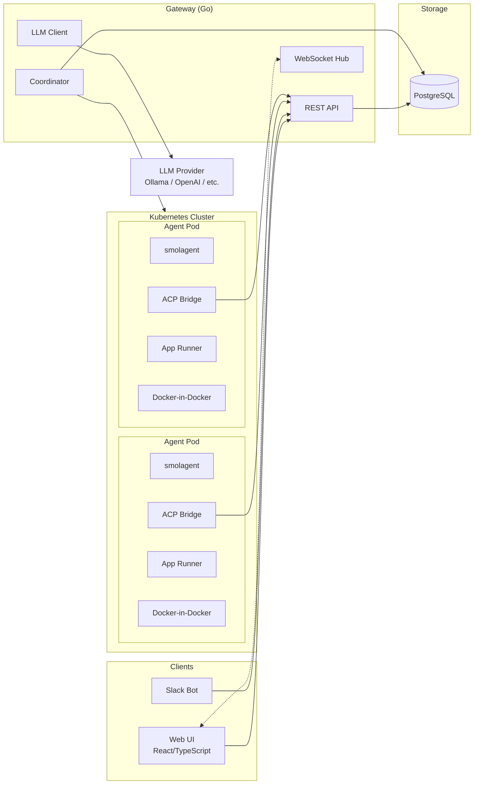
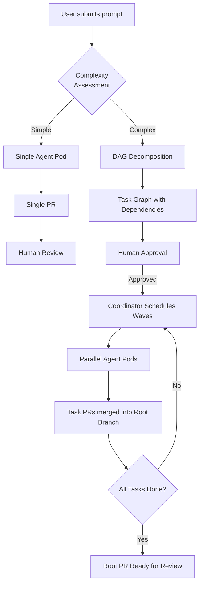
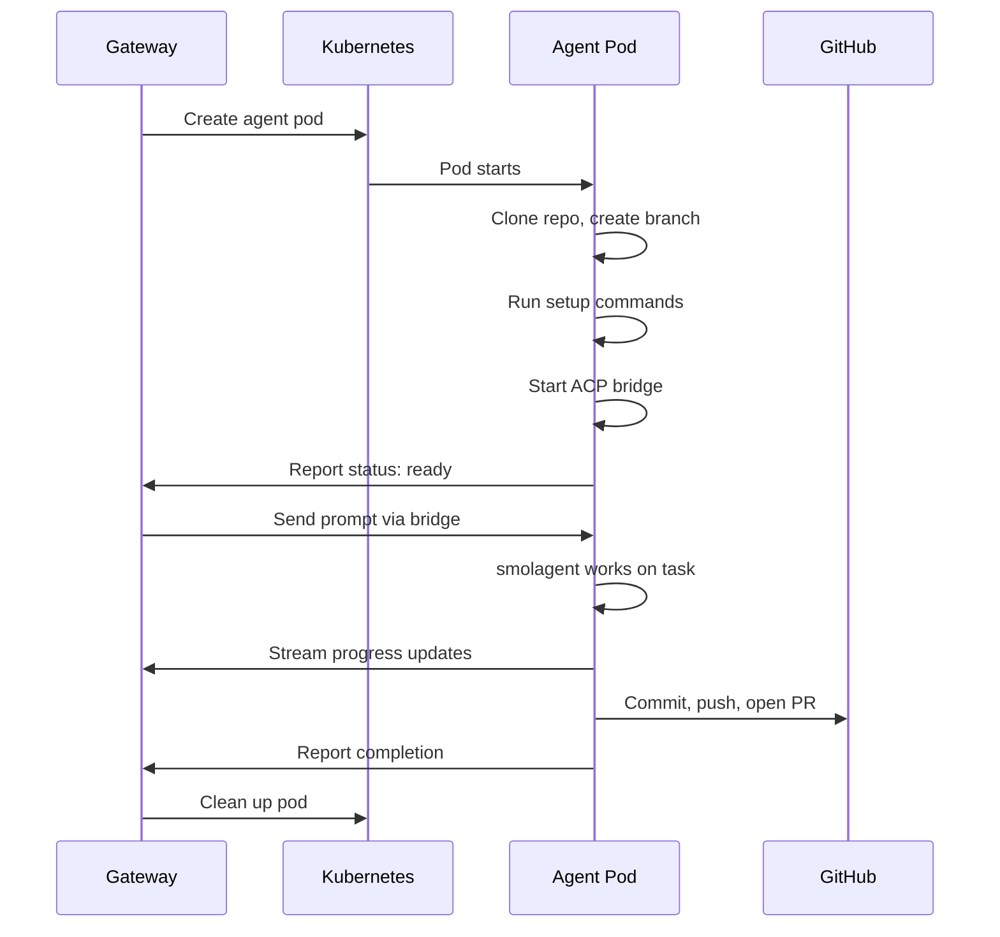

# smol-gang

A Kubernetes-based system that orchestrates multiple [smolagent](https://github.com/huggingface/smolagents) instances to work on features in parallel across one or many repositories.

smol-gang decomposes complex development tasks into a DAG of independent subtasks, executes them in parallel via LLM-powered agents running in Kubernetes pods, and uses GitHub Pull Requests as the primary coordination mechanism.

## Architecture



Each agent pod contains three containers:
- **Agent** — [smolagent](https://github.com/huggingface/smolagents) connected via ACP (Agent Client Protocol) to a bridge server
- **App Runner** — runs the application under development with port forwarding
- **DinD** — Docker-in-Docker sidecar for builds and container operations

## How It Works



**Simple tasks** (bug fix, config change) skip decomposition and go straight to a single agent + PR.

**Complex tasks** get broken into a DAG of subtasks with dependency tracking. The coordinator schedules tasks in waves — independent tasks run in parallel, dependent tasks wait for their prerequisites to complete. Each task gets its own Kubernetes pod, git branch, and PR.

## Agent Lifecycle



## Prerequisites

- [Docker](https://docs.docker.com/get-docker/) (with Docker Compose)
- [Kind](https://kind.sigs.k8s.io/docs/user/quick-start/#installation) (Kubernetes in Docker)
- [kubectl](https://kubernetes.io/docs/tasks/tools/)
- [Helm](https://helm.sh/docs/intro/install/) (v3+)
- [Go](https://go.dev/dl/) 1.22+ (for gateway development)
- [Node.js](https://nodejs.org/) 18+ (for web UI development)
- An LLM API endpoint (OpenAI-compatible — local Ollama, OpenAI, Anthropic, etc.)

## Quick Start

### 1. Clone and configure

```bash
git clone https://github.com/streed/smol-gang.git
cd smol-gang
cp .env.example .env
```

Edit `.env` with your settings:

```bash
# Point to your LLM API (default: local Ollama)
LLM_API_URL=http://host.docker.internal:11434/v1
LLM_API_KEY=           # leave empty for Ollama
LLM_MODEL=llama3       # or gpt-4, claude-sonnet-4-20250514, etc.

# Optional integrations
GITHUB_APP_ID=
SLACK_BOT_TOKEN=
SLACK_SIGNING_SECRET=

# Auth (change in production!)
JWT_SECRET=dev-jwt-secret-change-in-production
ADMIN_EMAIL=admin@localhost
ADMIN_PASSWORD=admin
```

### 2. Start everything

```bash
make dev
```

This will:
1. Create `.env` from `.env.example` if it doesn't exist
2. Start Docker Compose services (PostgreSQL, Gateway, Web UI)
3. Create a Kind Kubernetes cluster (1 control-plane + 2 workers)
4. Install the Helm chart into the Kind cluster

### 3. Access the application

| Service     | URL                        |
|-------------|----------------------------|
| Web UI      | http://localhost:3000       |
| Gateway API | http://localhost:8080       |
| PostgreSQL  | localhost:5432              |

Default login: `admin@localhost` / `admin`

## Development

### Make Targets

```bash
make help                # Show all available targets
```

| Target              | Description                                     |
|---------------------|-------------------------------------------------|
| `make dev`          | Start full local dev environment                |
| `make dev-down`     | Stop everything                                 |
| `make dev-compose`  | Start Docker Compose only (no K8s)              |
| `make dev-compose-down` | Stop Docker Compose services                |
| `make build`        | Build all Docker images                         |
| `make test`         | Run all tests                                   |
| `make lint`         | Run linters                                     |
| `make seed`         | Seed test data                                  |
| `make kind-setup`   | Create Kind K8s cluster                         |
| `make kind-teardown`| Delete Kind K8s cluster                         |
| `make kind-load`    | Build and load images into Kind                 |
| `make helm-install` | Install Helm chart to Kind cluster              |
| `make helm-uninstall`| Uninstall Helm chart                           |
| `make clean`        | Remove everything (containers, images, cluster) |

### Gateway (Go)

```bash
cd gateway
go test ./...          # Run tests
go vet ./...           # Lint
go build ./cmd/gateway # Build binary
```

The gateway uses [Chi](https://github.com/go-chi/chi) for routing, PostgreSQL via `pgxpool`, Kubernetes client-go for pod management, JWT auth with RBAC, and a WebSocket hub for real-time messaging.

### Web UI (React/TypeScript)

```bash
cd web
npm install
npm run dev            # Vite dev server with hot reload
npm run build          # Production build
npm run lint           # ESLint
```

### Agent

The agent runs inside Kubernetes pods. For local image builds:

```bash
make build-agent
```

Agent components:
- `scripts/entrypoint.sh` — orchestrates clone, setup, smolagent startup, and bridge
- `scripts/bridge.mjs` — ACP bridge between gateway and smolagent
- `scripts/cleanup.sh` — commits, pushes, and reports final status
- `scripts/setup.sh` — runs repo-specific setup commands
- `scripts/app-entrypoint.sh` — starts the application container

### Docker Compose Only (no Kubernetes)

For frontend development without launching agent pods:

```bash
make dev-compose       # Start postgres + gateway + web
make dev-compose-down  # Stop
```

### Kubernetes Debugging

```bash
kubectl get pods -n smol-gang            # Pod status
kubectl get svc -n smol-gang             # Services
kubectl logs -n smol-gang <pod> -c agent -f  # Agent logs
kubectl exec -it -n smol-gang <pod> -c app -- /bin/sh  # Shell into app container
```

## Observability

An optional observability stack is included:

```bash
cd observability
docker compose -f docker-compose.observability.yml up -d
```

| Service    | URL                    |
|------------|------------------------|
| Prometheus | http://localhost:9090   |
| Grafana    | http://localhost:3001   |
| Loki       | http://localhost:3100   |

Grafana comes pre-configured with Prometheus and Loki datasources and smol-gang dashboards.

## Slack Integration

smol-gang supports Slack slash commands for managing workstreams:

1. Create a Slack App at https://api.slack.com/apps
2. Add a Slash Command: `/smol` pointing to `https://your-gateway/api/v1/slack/command`
3. Enable Interactivity with URL: `https://your-gateway/api/v1/slack/interact`
4. Add `SLACK_BOT_TOKEN` and `SLACK_SIGNING_SECRET` to your `.env`

Commands: `/smol list`, `/smol status <name>`, `/smol start <repo> <branch> <prompt>`, `/smol message <name> <msg>`, `/smol complete <name>`, `/smol cancel <name>`, `/smol repos`, `/smol help`

## Helm Chart

For production-like deployments:

```bash
helm upgrade --install smol-gang ./helm/smol-gang \
  --namespace smol-gang --create-namespace \
  -f helm/smol-gang/values.yaml \
  --set secrets.jwtSecret="your-secret" \
  --set secrets.databasePassword="your-password"
```

The chart includes gateway, PostgreSQL, RBAC, ingress, network policies, and the observability stack (Prometheus, Loki, Grafana, Promtail).

## Project Structure

```
smol-gang/
├── agent/                    # Agent container
│   ├── Dockerfile           # Agent image (smolagent + ACP bridge)
│   ├── Dockerfile.apprunner # App runner sidecar image
│   └── scripts/             # Entrypoint, bridge, cleanup scripts
├── gateway/                  # Go API server
│   ├── cmd/gateway/         # Entry point
│   ├── internal/            # Handlers, K8s client, middleware, models
│   └── migrations/          # SQL migrations
├── web/                      # React/TypeScript frontend
│   └── src/
│       ├── pages/           # Dashboard, Workstreams, Plans, etc.
│       ├── components/      # ChatInterface, Terminal, Layout, etc.
│       ├── hooks/           # useWebSocket
│       ├── store/           # Zustand auth store
│       └── api/             # Axios API client
├── helm/smol-gang/          # Helm chart for Kubernetes
├── observability/            # Prometheus/Loki/Grafana stack
├── docs/                     # Design documentation
├── scripts/                  # Dev setup, Kind config, seed data
├── docker-compose.yml        # Local development services
├── Makefile                  # Build/dev automation
└── .env.example              # Environment template
```

## Documentation

- [Design Document](docs/design.md) — detailed system architecture, DAG execution model, and implementation design

## Contributing

See [CONTRIBUTING.md](CONTRIBUTING.md) for development guidelines and how to submit changes.

## License

This project is licensed under the MIT License. See [LICENSE](LICENSE) for details.
