# smol-gang: Design Document

## Overview

smol-gang is a DAG-based multi-agent task orchestrator that decomposes complex tasks into independent subtasks, executes them in parallel via LLM-powered agents, and uses GitHub Pull Requests as the primary coordination, gating, and audit mechanism.

The system targets local LLM inference via Ollama (70B+ parameter models) and is built in Go for straightforward concurrency, fast compilation, and easy deployment as a single binary.

The system is designed to be **distributed and recoverable**: the Coordinator persists all state to a durable store, workers can run as separate processes on separate machines, and the entire plan can be reconstructed from persistent state + GitHub after a crash.

## Architecture

### High-Level Flow

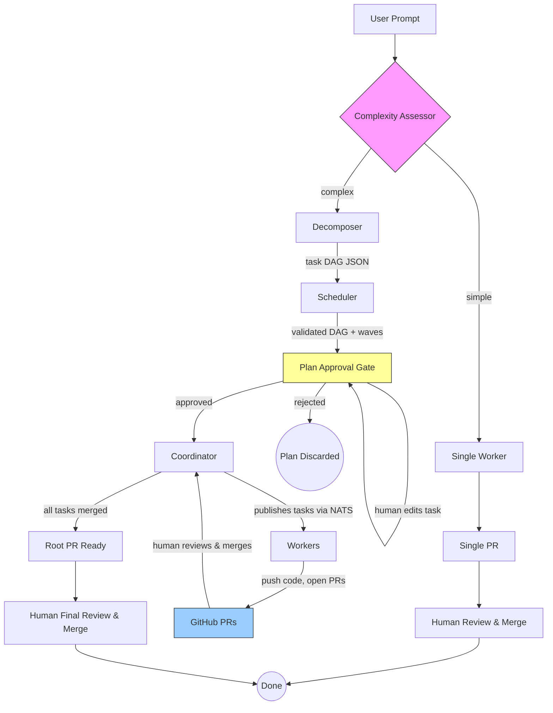

Not every task needs a DAG. Fixing a typo, updating a config value, or adding a single function don't benefit from decomposition — the overhead of planning, branching, and coordinating is wasted. The Complexity Assessor gates entry into the full pipeline.

### Design Principles

1. **Don't over-engineer simple tasks.** A complexity assessment gates entry into the full DAG pipeline. Simple tasks skip decomposition entirely and execute as a single PR. The overhead of planning, coordinating, and merging multiple PRs is only worth it for genuinely complex work.
2. **The database is the source of truth.** All plan state, task status, and conversation history are persisted. In-memory state is a cache that can be rebuilt.
3. **GitHub is the secondary source of truth.** On recovery, the Coordinator reconciles DB state against actual GitHub PR statuses to catch any events missed during downtime.
4. **Workers are stateless and replaceable.** A worker claims a task, does the work, and reports back. If it dies, the task is reclaimed by another worker after a lease expires.
5. **All state transitions are idempotent.** Processing the same event twice produces the same result. This makes retries safe.
6. **Every operation that changes state writes to the DB before acknowledging.** No in-memory-only state transitions.

### Components

#### 1. Complexity Assessor

The first step in every smol-gang invocation. Determines whether the task is simple enough to execute directly as a single PR, or complex enough to warrant DAG decomposition.

**Input:** The user prompt plus optional repository context (same inputs the Decomposer would receive).

**Output:** A structured classification:

```go
type ComplexityVerdict struct {
    Complexity  ComplexityLevel `json:"complexity"`   // "simple" or "complex"
    Reasoning   string          `json:"reasoning"`    // why this classification
    Confidence  float64         `json:"confidence"`   // 0.0-1.0
    EstTasks    int             `json:"est_tasks"`    // estimated subtask count if decomposed
    Suggestion  string          `json:"suggestion"`   // brief approach description
}

type ComplexityLevel string

const (
    ComplexitySimple  ComplexityLevel = "simple"
    ComplexityComplex ComplexityLevel = "complex"
)
```

**Classification Criteria:**

A task is **simple** if it meets ALL of these:
- Touches 1-3 files
- Involves a single logical change (one concern)
- No ordering dependencies within the work
- A single developer could complete it without context-switching
- Examples: bug fix, config change, add a single endpoint, update a dependency, rename a module, add a test

A task is **complex** if ANY of these are true:
- Touches 4+ files across multiple modules or layers
- Involves multiple distinct concerns that could be worked on independently
- Has internal ordering dependencies (X must exist before Y can be built)
- Would naturally be split into multiple PRs by a human team
- Examples: add a full feature (auth system, payment flow), large refactor, migrate between frameworks, build a new service

**Implementation:**
- Single LLM call using Ollama JSON mode with the assessment prompt (see Appendix G)
- Uses the heavy model — this decision gates the entire workflow, so accuracy matters
- If `confidence < 0.6`, default to **complex** (safer to over-decompose than to miss parallelism)
- The `--simple` and `--complex` CLI flags bypass the assessment entirely for when the user already knows

**Simple Path Execution:**

When the Assessor returns `simple`, the full DAG pipeline is skipped. Instead:
1. A plan is created in the database with a single task
2. A single branch and PR are created (no root PR wrapper needed)
3. A worker claims and executes the task directly
4. The human reviews and merges the single PR
5. Done — no Coordinator event loop, no wave scheduling

This still goes through the database and NATS for consistency and recoverability, but the task itself is a single-node "DAG" with no dependencies.

```go
func (s *SmolGang) Run(ctx context.Context, prompt string, repoCtx string) error {
    // Step 1: Assess complexity (unless overridden with --simple or --complex)
    verdict, err := s.assessor.Assess(ctx, prompt, repoCtx)
    if err != nil {
        return fmt.Errorf("complexity assessment: %w", err)
    }

    s.log.Info().
        Str("complexity", string(verdict.Complexity)).
        Float64("confidence", verdict.Confidence).
        Int("est_tasks", verdict.EstTasks).
        Msg("complexity assessment complete")

    switch verdict.Complexity {
    case ComplexitySimple:
        return s.runSimple(ctx, prompt, repoCtx, verdict)
    case ComplexityComplex:
        return s.runComplex(ctx, prompt, repoCtx)
    default:
        return s.runComplex(ctx, prompt, repoCtx)
    }
}

func (s *SmolGang) runSimple(ctx context.Context, prompt, repoCtx string, verdict ComplexityVerdict) error {
    s.log.Info().Msg("simple task — skipping DAG decomposition and approval gate")

    // Simple tasks skip approval — they're small enough that the PR review
    // itself is sufficient human oversight.
    task := &TaskNode{
        ID:                 "main",
        Description:        prompt,
        DependsOn:          []TaskId{},
        FileScope:          []string{}, // agent will determine
        AcceptanceCriteria: []string{"Task completed as described in the prompt"},
        ModelTier:          ModelTierHeavy,
    }

    plan := &PlanRecord{
        ID:         uuid.New().String(),
        Prompt:     prompt,
        Status:     "active", // skip pending_approval for simple tasks
    }

    if err := s.store.InsertPlan(ctx, plan); err != nil {
        return err
    }
    // ... create branch, publish task to NATS, single worker picks it up
    return nil
}

func (s *SmolGang) runComplex(ctx context.Context, prompt, repoCtx string) error {
    // Step 1: Decompose into task DAG
    tasks, err := s.decomposer.Decompose(ctx, prompt, repoCtx)
    if err != nil {
        return fmt.Errorf("decomposition: %w", err)
    }

    // Step 2: Validate and schedule
    plan, err := s.scheduler.Schedule(tasks)
    if err != nil {
        return fmt.Errorf("scheduling: %w", err)
    }

    // Step 3: Persist as pending_approval — NO work starts yet
    record := &PlanRecord{
        ID:       uuid.New().String(),
        Prompt:   prompt,
        PlanJSON: marshal(plan),
        Status:   "pending_approval",
    }
    if err := s.store.InsertPlan(ctx, record); err != nil {
        return err
    }

    s.log.Info().
        Str("plan_id", record.ID).
        Int("tasks", len(tasks)).
        Msg("plan created — awaiting approval. Use 'smol-gang plan show' to review, 'smol-gang plan approve' to start.")

    // Execution begins only after human calls 'smol-gang plan approve --plan-id <id>'
    // or POST /api/plans/{id}/approve
    return nil
}
```

#### 2. Decomposer

Responsible for taking a complex user prompt and producing a structured task DAG suitable for parallel execution via GitHub PRs. Only invoked when the Complexity Assessor returns `complex`.

**Input:** A natural language task description plus optional context (repo structure, existing code, constraints).

**Output:** A JSON task graph where each task maps to a single PR with a clear, isolated scope.

**Implementation:**
- Single LLM call to the strongest available local model (e.g., Llama 3.1 70B, DeepSeek Coder V2, Qwen 2.5 72B)
- Uses Ollama JSON mode for structured output
- A validation pass (pure Go, no LLM needed) checks:
  - The graph is a valid DAG (no cycles) via Kahn's algorithm
  - All `depends_on` references point to existing task IDs
  - No orphan tasks (every non-root task has at least one dependency or is explicitly independent)
  - Task descriptions are actionable and PR-scoped (heuristic: rejects tasks that are too vague or too broad)
- The validated plan is persisted to the database before execution begins

**Decomposition Prompt:** See Appendix A.

**Retry Strategy:** If validation fails (cycles detected, invalid references), send the validation errors back to the LLM with the original output and ask it to fix the structure. Max 2 retries before surfacing the error to the user.

#### 3. Scheduler

Pure Go module. Takes the validated task list and produces an execution plan.

**Responsibilities:**
- Builds a directed graph from the task list using an adjacency list representation
- Runs topological sort via Kahn's algorithm (which also serves as cycle detection)
- Groups tasks into execution waves by BFS depth from root nodes:
  - Wave 0: all tasks with zero in-degree (no dependencies)
  - Wave N: tasks whose dependencies are all in waves < N
- Calculates the critical path (longest chain of sequential dependencies) for estimated completion time

**Key Data Structures:**

```go
type TaskId = string

type ModelTier string

const (
    ModelTierHeavy ModelTier = "heavy"
    ModelTierLight ModelTier = "light"
    ModelTierAuto  ModelTier = "auto"
)

type TaskNode struct {
    ID                 TaskId    `json:"id"`
    Description        string    `json:"description"`
    DependsOn          []TaskId  `json:"depends_on"`
    FileScope          []string  `json:"file_scope"`
    AcceptanceCriteria []string  `json:"acceptance_criteria"`
    ModelTier          ModelTier `json:"model_tier"`
}

// DAG is an adjacency list directed graph with in-degree tracking
type DAG struct {
    Nodes    map[TaskId]*TaskNode
    Edges    map[TaskId][]TaskId  // parent → children
    InDegree map[TaskId]int
}

type ExecutionPlan struct {
    Graph        *DAG
    Waves        [][]TaskId
    CriticalPath []TaskId
}
```

**Wave computation algorithm:**

```go
func (d *DAG) ComputeWaves() ([][]TaskId, error) {
    inDegree := make(map[TaskId]int)
    for id, deg := range d.InDegree {
        inDegree[id] = deg
    }

    var waves [][]TaskId
    remaining := len(d.Nodes)

    for remaining > 0 {
        var wave []TaskId
        for id, deg := range inDegree {
            if deg == 0 {
                wave = append(wave, id)
            }
        }
        if len(wave) == 0 {
            return nil, fmt.Errorf("cycle detected: %d nodes unreachable", remaining)
        }

        for _, id := range wave {
            delete(inDegree, id)
            for _, child := range d.Edges[id] {
                inDegree[child]--
            }
        }

        waves = append(waves, wave)
        remaining -= len(wave)
    }

    return waves, nil
}
```

Note: Waves represent *maximum* parallelism boundaries, but the Coordinator uses finer-grained event-driven scheduling (see below).

#### 4. Plan Approval Gate

After the Scheduler produces the execution plan, the plan enters a **pending approval** state. No work begins until a human reviews and explicitly approves the plan. During this window, the human can modify any aspect of the DAG.

**Why this exists:** LLM-generated decompositions aren't always right. The model might over-decompose a simple feature, miss a dependency, scope a task too broadly, or get the file paths wrong. Letting the human inspect and edit the plan before committing workers (and burning GPU time + API calls) catches these problems cheaply.

**Plan Status Flow:**

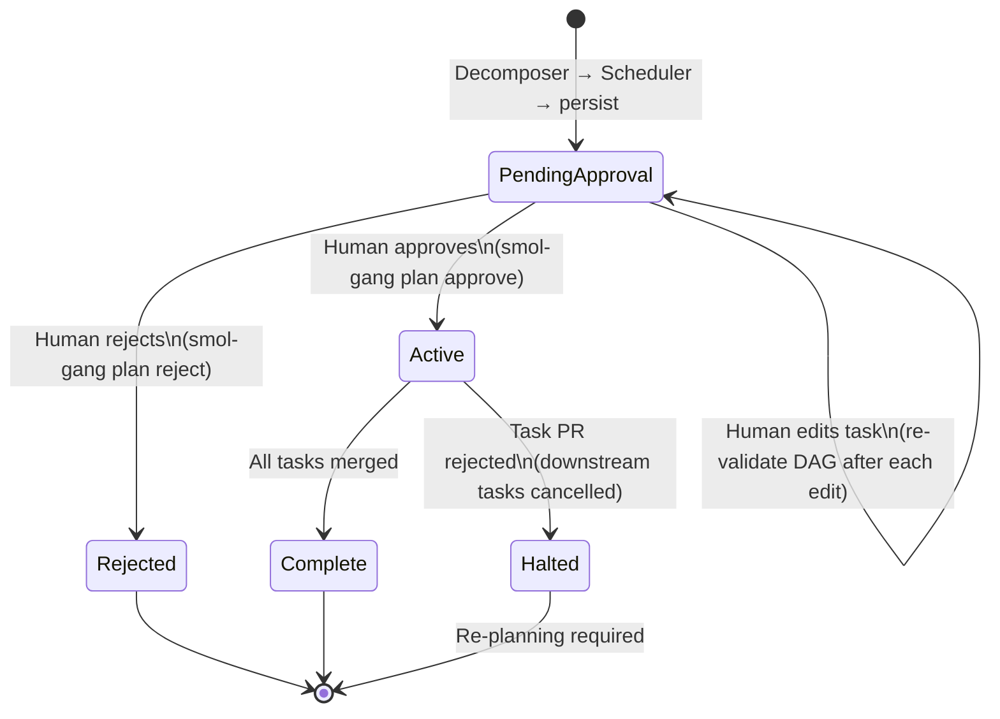

**What the human can edit during approval:**

- **Modify a task's description** — add more detail, clarify requirements, specify exact function signatures or file paths
- **Add acceptance criteria** — append new conditions to any task
- **Add a new task** — insert a task into the DAG with its own dependencies and dependents
- **Remove a task** — delete a task (any tasks that depended on it are re-linked to its parents, or flagged for review)
- **Change dependencies** — reorder the DAG by adding or removing dependency edges
- **Change model tier** — override the LLM's suggestion for which model should handle a task
- **Split a task** — break one task into two with a dependency between them
- **Merge tasks** — combine two tasks that are too granular into one

After any edit, the Scheduler re-validates the DAG (cycle detection, orphan check) before saving. The plan stays in `pending_approval` until explicitly approved.

**Persisted State:**

```go
// Plan status values
const (
    PlanStatusPendingApproval = "pending_approval"  // awaiting human review
    PlanStatusActive          = "active"             // approved, executing
    PlanStatusHalted          = "halted"             // failed, needs re-plan
    PlanStatusComplete        = "complete"           // all tasks merged
    PlanStatusRejected        = "rejected"           // human rejected the plan
)
```

The `plans` table `status` column tracks this. The `plan_json` column is updated on every edit so the full history of changes is captured (or optionally, a separate `plan_revisions` table for audit).

**CLI Interface for Approval:**

```
# View the pending plan
smol-gang plan show --plan-id abc123

# Output:
# Plan: abc123 (pending_approval)
# Prompt: "Add user auth with JWT to this Express API"
# Tasks: 5 | Waves: 4 | Critical path: db-schema → user-model → login-endpoint → auth-middleware
#
# Wave 0: db-schema (light)
# Wave 1: user-model (auto) ← depends on: db-schema
# Wave 2: register-endpoint (auto) ← depends on: user-model
#          login-endpoint (auto) ← depends on: user-model
# Wave 3: auth-middleware (light) ← depends on: login-endpoint
#
# Use 'smol-gang plan edit' to modify, 'smol-gang plan approve' to start execution.

# Edit a specific task
smol-gang plan edit --plan-id abc123 --task db-schema --description "Create migration with users table. Include email_verified boolean column."
smol-gang plan edit --plan-id abc123 --task db-schema --add-criteria "email_verified column defaults to false"

# Add a new task
smol-gang plan add-task --plan-id abc123 \
    --id "email-verification" \
    --description "Add email verification flow..." \
    --depends-on "register-endpoint" \
    --file-scope "src/services/email.js,src/routes/verify.js"

# Remove a task
smol-gang plan remove-task --plan-id abc123 --task auth-middleware

# Change dependencies
smol-gang plan add-dep --plan-id abc123 --task auth-middleware --depends-on register-endpoint
smol-gang plan remove-dep --plan-id abc123 --task auth-middleware --depends-on login-endpoint

# Approve and start execution
smol-gang plan approve --plan-id abc123

# Reject and discard
smol-gang plan reject --plan-id abc123
```

**API Interface for Approval:**

For non-CLI integrations (web UI, Slack bot, etc.), the Coordinator exposes HTTP endpoints:

```go
// Plan review and approval endpoints
// GET  /api/plans/{id}                     — view plan with all tasks
// PUT  /api/plans/{id}/tasks/{task-id}     — update a task (description, criteria, model_tier, deps)
// POST /api/plans/{id}/tasks               — add a new task
// DELETE /api/plans/{id}/tasks/{task-id}   — remove a task
// POST /api/plans/{id}/approve             — approve plan, begin execution
// POST /api/plans/{id}/reject              — reject plan, discard

func (c *Coordinator) planRoutes(r chi.Router) {
    r.Route("/api/plans/{planID}", func(r chi.Router) {
        r.Get("/", c.handleGetPlan)
        r.Put("/tasks/{taskID}", c.handleUpdateTask)
        r.Post("/tasks", c.handleAddTask)
        r.Delete("/tasks/{taskID}", c.handleRemoveTask)
        r.Post("/approve", c.handleApprovePlan)
        r.Post("/reject", c.handleRejectPlan)
    })
}

func (c *Coordinator) handleUpdateTask(w http.ResponseWriter, r *http.Request) {
    planID := chi.URLParam(r, "planID")
    taskID := chi.URLParam(r, "taskID")

    var update TaskUpdate
    if err := json.NewDecoder(r.Body).Decode(&update); err != nil {
        http.Error(w, "invalid body", http.StatusBadRequest)
        return
    }

    // Apply the update
    plan, err := c.store.GetPlan(r.Context(), planID)
    if err != nil || plan.Status != PlanStatusPendingApproval {
        http.Error(w, "plan not found or not editable", http.StatusBadRequest)
        return
    }

    // Modify the task in the plan
    if err := c.applyTaskUpdate(r.Context(), planID, taskID, update); err != nil {
        http.Error(w, err.Error(), http.StatusBadRequest)
        return
    }

    // Re-validate DAG after edit
    if err := c.revalidatePlan(r.Context(), planID); err != nil {
        http.Error(w, fmt.Sprintf("validation failed after edit: %s", err), http.StatusConflict)
        return
    }

    w.WriteHeader(http.StatusOK)
}

func (c *Coordinator) handleApprovePlan(w http.ResponseWriter, r *http.Request) {
    planID := chi.URLParam(r, "planID")

    plan, err := c.store.GetPlan(r.Context(), planID)
    if err != nil || plan.Status != PlanStatusPendingApproval {
        http.Error(w, "plan not found or not pending approval", http.StatusBadRequest)
        return
    }

    // Final validation
    if err := c.revalidatePlan(r.Context(), planID); err != nil {
        http.Error(w, fmt.Sprintf("plan validation failed: %s", err), http.StatusConflict)
        return
    }

    // Transition to active and begin execution
    if err := c.store.UpdatePlanStatus(r.Context(), planID, PlanStatusActive); err != nil {
        http.Error(w, "failed to activate plan", http.StatusInternalServerError)
        return
    }

    // Kick off the Coordinator event loop for this plan
    go c.executePlan(r.Context(), planID)

    w.WriteHeader(http.StatusAccepted)
    json.NewEncoder(w).Encode(map[string]string{"status": "approved", "plan_id": planID})
}

type TaskUpdate struct {
    Description        *string   `json:"description,omitempty"`
    AcceptanceCriteria []string  `json:"acceptance_criteria,omitempty"`  // replaces if provided
    AddCriteria        []string  `json:"add_criteria,omitempty"`        // appends
    DependsOn          []TaskId  `json:"depends_on,omitempty"`          // replaces if provided
    FileScope          []string  `json:"file_scope,omitempty"`          // replaces if provided
    ModelTier          *string   `json:"model_tier,omitempty"`
}
```

**`--auto-approve` flag:**

For CI/CD pipelines or trusted automated workflows, the `--auto-approve` flag skips the approval gate and immediately transitions the plan to `active`. This is opt-in and should be used with caution.

```
smol-gang run --prompt "Add user auth" --auto-approve
```

#### 5. Coordinator

The central orchestration process. Manages the full lifecycle of a smol-gang execution. Designed to crash and recover cleanly.

**Responsibilities:**
- Creates the root feature branch and empty root PR on GitHub
- Maintains the canonical DAG state with per-task status tracking, **persisted to the database on every state transition**
- Publishes ready tasks to NATS for workers to claim
- Listens for GitHub events (PR merged, changes requested, PR closed)
- Monitors worker heartbeats, reclaims tasks from dead workers
- Handles notifications for merge conflicts and other human-attention events
- Halts the entire plan on partial failure (PR rejected/closed without merge)
- On startup, reconciles DB state against GitHub to recover from crashes

**Persisted State (Database):**

```go
// Stored in `plans` table
type PlanRecord struct {
    ID            string    `db:"id"`             // UUID
    Prompt        string    `db:"prompt"`
    PlanJSON      string    `db:"plan_json"`      // full ExecutionPlan serialized
    RootBranch    string    `db:"root_branch"`
    RootPR        int       `db:"root_pr"`
    Status        string    `db:"status"`         // pending_approval, active, halted, complete, rejected
    RepoOwner     string    `db:"repo_owner"`
    RepoName      string    `db:"repo_name"`
    BaseBranch    string    `db:"base_branch"`
    CreatedAt     time.Time `db:"created_at"`
    UpdatedAt     time.Time `db:"updated_at"`
}

// Stored in `tasks` table
type TaskRecord struct {
    ID            string     `db:"id"`            // task-id (e.g., "db-schema")
    PlanID        string     `db:"plan_id"`       // FK to plans
    Status        string     `db:"status"`        // pending, ready, claimed, working, pr_open, in_review, changes_requested, merged, failed
    BranchName    string     `db:"branch_name"`
    PRNumber      int        `db:"pr_number"`
    WorkerID      string     `db:"worker_id"`     // which worker claimed this task
    LeaseExpiry   *time.Time `db:"lease_expiry"`  // when the claim expires if no heartbeat
    Error         string     `db:"error"`
    CreatedAt     time.Time  `db:"created_at"`
    UpdatedAt     time.Time  `db:"updated_at"`
}

// Stored in `task_conversations` table — LLM conversation history per task
type ConversationRecord struct {
    ID        string    `db:"id"`
    TaskID    string    `db:"task_id"`
    PlanID    string    `db:"plan_id"`
    Role      string    `db:"role"`       // system, user, assistant
    Content   string    `db:"content"`
    Sequence  int       `db:"sequence"`   // ordering
    CreatedAt time.Time `db:"created_at"`
}

// Stored in `events` table — durable event log for replay
type EventRecord struct {
    ID        string    `db:"id"`
    PlanID    string    `db:"plan_id"`
    TaskID    string    `db:"task_id"`
    EventType string   `db:"event_type"`
    Payload   string    `db:"payload"`    // JSON
    Processed bool      `db:"processed"`
    CreatedAt time.Time `db:"created_at"`
}
```

**State Transition Flow (write-through):**

Every state change follows this pattern:
1. Validate the transition is legal (state machine check)
2. Write the new state to the database in a transaction
3. Update in-memory cache
4. Publish side effects (NATS messages, notifications)

If step 3 or 4 fails after step 2 succeeds, the recovery process will re-derive side effects from DB state on next startup.

```go
func (c *Coordinator) transitionTask(ctx context.Context, taskID TaskId, newStatus string, opts ...TransitionOpt) error {
    c.mu.Lock()
    defer c.mu.Unlock()

    task, ok := c.tasks[taskID]
    if !ok {
        return fmt.Errorf("unknown task: %s", taskID)
    }

    if !isValidTransition(task.Status, newStatus) {
        return fmt.Errorf("invalid transition: %s → %s for task %s", task.Status, newStatus, taskID)
    }

    // Apply options (set worker_id, pr_number, error, etc.)
    for _, opt := range opts {
        opt(task)
    }

    // Write to DB first — this is the commit point
    if err := c.store.UpdateTaskStatus(ctx, taskID, c.planID, newStatus, task); err != nil {
        return fmt.Errorf("persist transition: %w", err)
    }

    // Update in-memory state
    task.Status = newStatus

    return nil
}
```

**Event-Driven Scheduling (not strict wave batching):**

The Coordinator does NOT wait for an entire wave to complete. When *any* PR merges, it recalculates which pending tasks now have all dependencies satisfied and immediately publishes them as ready for workers.

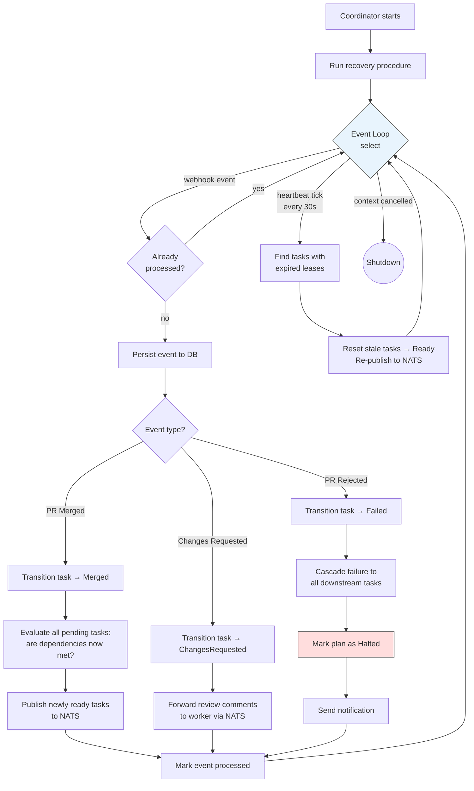

The Coordinator runs a central event loop consuming from multiple sources:

```go
func (c *Coordinator) Run(ctx context.Context) error {
    // Phase 1: Recovery — reconcile DB state with GitHub
    if err := c.recover(ctx); err != nil {
        return fmt.Errorf("recovery failed: %w", err)
    }

    // Phase 2: Start subsystems
    webhookEvents := make(chan Event, 64)
    go c.webhookListener(ctx, webhookEvents)

    heartbeatTicker := time.NewTicker(30 * time.Second)
    defer heartbeatTicker.Stop()

    // Phase 3: Main event loop
    for {
        select {
        case <-ctx.Done():
            return ctx.Err()
        case evt := <-webhookEvents:
            if err := c.handleEvent(ctx, evt); err != nil {
                c.log.Error().Err(err).Str("event", evt.Type.String()).Msg("event handling failed")
            }
        case <-heartbeatTicker.C:
            c.reclaimStaleTasks(ctx)
        }
    }
}

func (c *Coordinator) handleEvent(ctx context.Context, evt Event) error {
    // Idempotency check: has this event already been processed?
    if c.store.EventProcessed(ctx, evt.ID) {
        return nil
    }

    // Persist event to durable log before processing
    if err := c.store.InsertEvent(ctx, evt); err != nil {
        return err
    }

    var err error
    switch evt.Type {
    case EventPRMerged:
        err = c.onPRMerged(ctx, evt.TaskID)
    case EventChangesRequested:
        err = c.onChangesRequested(ctx, evt.TaskID, evt.Payload)
    case EventPRRejected:
        err = c.onPRRejected(ctx, evt.TaskID)
    case EventWorkerError:
        err = c.onWorkerError(ctx, evt.TaskID, evt.Payload)
    }

    if err == nil {
        c.store.MarkEventProcessed(ctx, evt.ID)
    }
    return err
}
```

**Task Readiness Check (called after any merge):**

```go
func (c *Coordinator) evaluateReadyTasks(ctx context.Context) error {
    c.mu.RLock()
    defer c.mu.RUnlock()

    for id, task := range c.tasks {
        if task.Status != "pending" {
            continue
        }
        allMerged := true
        for _, dep := range task.Node.DependsOn {
            if c.tasks[dep].Status != "merged" {
                allMerged = false
                break
            }
        }
        if allMerged {
            if err := c.publishReadyTask(ctx, id); err != nil {
                return err
            }
        }
    }
    return nil
}
```

**Failure Handling:**

When a PR is closed without merging (rejected by reviewer):
1. Mark the task as `failed` in the database
2. Walk the DAG and mark ALL downstream dependents as `failed` in the database
3. Publish shutdown signals to NATS for any workers on affected tasks
4. Send a notification to the notification queue with full context
5. Mark the plan as `halted` in the database
6. Re-planning requires a new user prompt or manual intervention

**Merge Conflict Handling:**

When a rebase fails for a task branch (detected before agent starts work):
1. Mark the task as `blocked` in the database
2. Send a notification to the notification queue with conflict details
3. Wait for human resolution. The human resolves the conflict, pushes, and the Coordinator retries.

#### 6. Workers

Separate processes that claim and execute tasks. A Worker stays alive from task claim until its PR is merged. Workers can run on different machines.

**Design:**
- Workers are **stateless processes** that connect to NATS to receive task assignments
- Each worker has a unique ID (hostname + PID + random suffix)
- Workers claim tasks via NATS queue groups (competing consumers — only one worker gets each task)
- Workers send heartbeats to the Coordinator via NATS at regular intervals
- Workers persist their LLM conversation history to the database so another worker can resume if one dies

**Lifecycle:**
1. Subscribe to NATS queue group `smol-gang.tasks` for new task assignments
2. Receive a task assignment, claim it in the database (sets `worker_id` and `lease_expiry`)
3. Load any existing conversation history from the database (for resumed tasks)
4. Create the branch from the current HEAD of the root feature branch
5. Execute the task: LLM calls + tool use (file read/write, shell commands, etc.)
6. **Persist each LLM conversation turn to the database as it happens**
7. Push commits to the branch
8. Open a PR targeting the root feature branch
9. Enter idle state, subscribe to NATS subject `smol-gang.tasks.{task-id}.reviews` for review events
10. On `ChangesRequested`: receive review comments, iterate, push new commits
11. On `Merged`: report success, shut down
12. On context cancellation / shutdown signal: clean up and exit (task can be reclaimed)

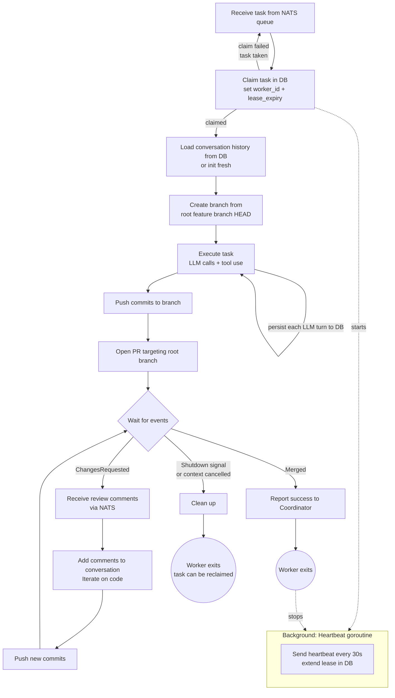

**Task Claiming and Leases:**

Workers don't just receive tasks — they *claim* them with a lease. This prevents two workers from working on the same task, and allows the Coordinator to reclaim tasks from dead workers.

```go
// Worker claims a task by setting worker_id and lease_expiry atomically
func (w *Worker) claimTask(ctx context.Context, taskID, planID string) error {
    leaseExpiry := time.Now().Add(w.config.LeaseDuration) // e.g., 10 minutes

    // Atomic claim: only succeeds if task is still in "ready" status with no worker
    claimed, err := w.store.ClaimTask(ctx, taskID, planID, w.id, leaseExpiry)
    if err != nil {
        return err
    }
    if !claimed {
        return fmt.Errorf("task %s already claimed by another worker", taskID)
    }

    // Start heartbeat goroutine
    go w.heartbeat(ctx, taskID, planID)
    return nil
}

// SQL for atomic claim:
// UPDATE tasks SET worker_id = $1, lease_expiry = $2, status = 'claimed'
// WHERE id = $3 AND plan_id = $4 AND status = 'ready' AND worker_id IS NULL

// Heartbeat extends the lease periodically
func (w *Worker) heartbeat(ctx context.Context, taskID, planID string) {
    ticker := time.NewTicker(w.config.HeartbeatInterval) // e.g., 30 seconds
    defer ticker.Stop()

    for {
        select {
        case <-ctx.Done():
            return
        case <-ticker.C:
            newExpiry := time.Now().Add(w.config.LeaseDuration)
            if err := w.store.ExtendLease(ctx, taskID, planID, w.id, newExpiry); err != nil {
                w.log.Error().Err(err).Msg("heartbeat failed")
                return
            }
        }
    }
}
```

**Coordinator reclaims stale tasks:**

```go
func (c *Coordinator) reclaimStaleTasks(ctx context.Context) {
    staleTasks, err := c.store.FindExpiredLeases(ctx, c.planID)
    if err != nil {
        c.log.Error().Err(err).Msg("failed to find stale tasks")
        return
    }

    for _, task := range staleTasks {
        c.log.Warn().Str("task", task.ID).Str("worker", task.WorkerID).Msg("reclaiming stale task")

        // Reset task to "ready" so it can be claimed by another worker
        // Conversation history is preserved in DB — new worker can resume
        if err := c.store.ReclaimTask(ctx, task.ID, task.PlanID); err != nil {
            c.log.Error().Err(err).Msg("failed to reclaim task")
            continue
        }

        // Re-publish to NATS for a new worker to pick up
        c.publishReadyTask(ctx, task.ID)
    }
}

// SQL for reclaim:
// UPDATE tasks SET worker_id = NULL, lease_expiry = NULL, status = 'ready'
// WHERE id = $1 AND plan_id = $2 AND lease_expiry < NOW()
```

**Conversation Persistence for Resumability:**

When a worker dies and another picks up the task, the new worker loads the full conversation history from the database and continues where the previous worker left off. The LLM sees the full context and can keep working.

```go
func (w *Worker) loadOrInitConversation(ctx context.Context, taskID, planID string, taskCtx WorkerContext) ([]Message, error) {
    // Try to load existing conversation from DB
    records, err := w.store.GetConversation(ctx, taskID, planID)
    if err != nil {
        return nil, err
    }

    if len(records) > 0 {
        // Resuming — rebuild message slice from DB records
        w.log.Info().Str("task", taskID).Int("turns", len(records)).Msg("resuming existing conversation")
        var messages []Message
        for _, r := range records {
            messages = append(messages, Message{Role: r.Role, Content: r.Content})
        }
        return messages, nil
    }

    // Fresh start — build initial messages from task context
    messages := []Message{
        {Role: "system", Content: buildSystemPrompt(taskCtx)},
        {Role: "user", Content: buildTaskPrompt(taskCtx)},
    }
    // Persist initial messages
    for i, msg := range messages {
        w.store.InsertConversationTurn(ctx, taskID, planID, msg.Role, msg.Content, i)
    }
    return messages, nil
}
```

**Context Assembly:**

When a task has dependencies, the Worker receives summaries of what each parent task accomplished. This is assembled from the database (parent task results).

```go
type WorkerContext struct {
    Task            *TaskNode
    ParentSummaries []ParentSummary
    RepoSnapshot    string
    BranchName      string
    PRTarget        string           // the root feature branch
}

type ParentSummary struct {
    TaskID       TaskId
    Description  string
    FilesChanged []string
    Summary      string  // LLM-generated summary of what the PR accomplished
}
```

**Tool Access:**

Workers need access to:
- File system operations (read, write, create, delete) within their branch checkout
- Shell command execution (via `os/exec`) for running tests, linters, build commands
- Git operations (commit, push) via git CLI or go-git
- Optionally: web search or documentation lookup for research-type tasks

### Recovery and Reconciliation

The Coordinator implements a recovery procedure that runs on every startup. This handles crashes, restarts, and missed webhook events.

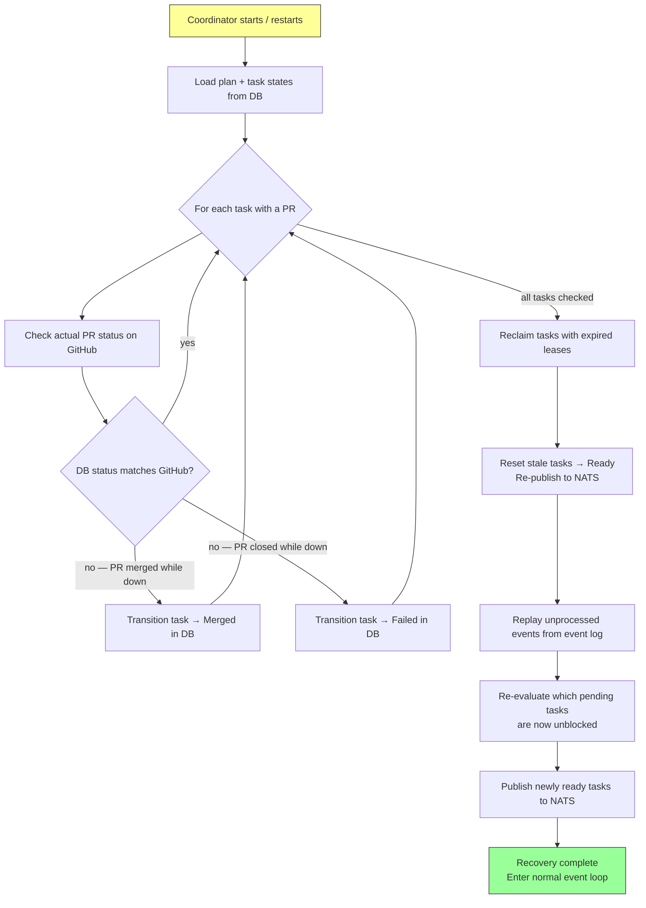

```go
func (c *Coordinator) recover(ctx context.Context) error {
    c.log.Info().Msg("starting recovery: reconciling DB state with GitHub")

    // 1. Load plan and all task states from database
    plan, err := c.store.GetPlan(ctx, c.planID)
    if err != nil {
        return fmt.Errorf("load plan: %w", err)
    }
    tasks, err := c.store.GetTasks(ctx, c.planID)
    if err != nil {
        return fmt.Errorf("load tasks: %w", err)
    }

    // 2. For each task that has a PR, check GitHub for the actual PR status
    for _, task := range tasks {
        if task.PRNumber == 0 {
            continue // no PR yet, nothing to reconcile
        }

        pr, err := c.github.GetPR(ctx, task.PRNumber)
        if err != nil {
            c.log.Warn().Err(err).Str("task", task.ID).Msg("failed to check PR status")
            continue
        }

        reconciled := c.reconcileTaskWithPR(task, pr)
        if reconciled {
            c.log.Info().Str("task", task.ID).Str("new_status", task.Status).Msg("reconciled task status from GitHub")
        }
    }

    // 3. Reclaim any tasks with expired leases (workers that died during downtime)
    c.reclaimStaleTasks(ctx)

    // 4. Replay any unprocessed events from the event log
    unprocessed, err := c.store.GetUnprocessedEvents(ctx, c.planID)
    if err != nil {
        return fmt.Errorf("load unprocessed events: %w", err)
    }
    for _, evt := range unprocessed {
        if err := c.handleEvent(ctx, evt.ToEvent()); err != nil {
            c.log.Error().Err(err).Str("event", evt.ID).Msg("failed to replay event")
        }
    }

    // 5. Re-evaluate which tasks are ready (in case merges happened while we were down)
    c.evaluateReadyTasks(ctx)

    c.log.Info().Msg("recovery complete")
    return nil
}

func (c *Coordinator) reconcileTaskWithPR(task *TaskRecord, pr *github.PullRequest) bool {
    githubStatus := prStatusFromGitHub(pr) // "open", "merged", "closed"

    switch {
    case githubStatus == "merged" && task.Status != "merged":
        // PR was merged while we were down
        c.transitionTask(context.Background(), task.ID, "merged")
        return true

    case githubStatus == "closed" && task.Status != "failed":
        // PR was rejected while we were down
        c.transitionTask(context.Background(), task.ID, "failed",
            withError("PR closed without merge (detected during recovery)"))
        return true

    case githubStatus == "open" && task.Status == "merged":
        // DB says merged but GitHub says open — DB is wrong (shouldn't happen, but safe to handle)
        c.log.Error().Str("task", task.ID).Msg("DB/GitHub mismatch: DB says merged, GitHub says open")
        return false
    }

    return false
}
```

### Communication: NATS

NATS serves as the message bus between the Coordinator and Workers. It handles task dispatch, review forwarding, heartbeats, and shutdown signals.

**Subjects:**

```
smol-gang.tasks                         # Queue group — new task assignments
smol-gang.tasks.{plan-id}.{task-id}.reviews  # Review comments for a specific task
smol-gang.tasks.{plan-id}.{task-id}.shutdown # Shutdown signal for a specific task
smol-gang.heartbeat.{plan-id}           # Worker heartbeat stream
smol-gang.events.{plan-id}              # Events from workers back to Coordinator
```

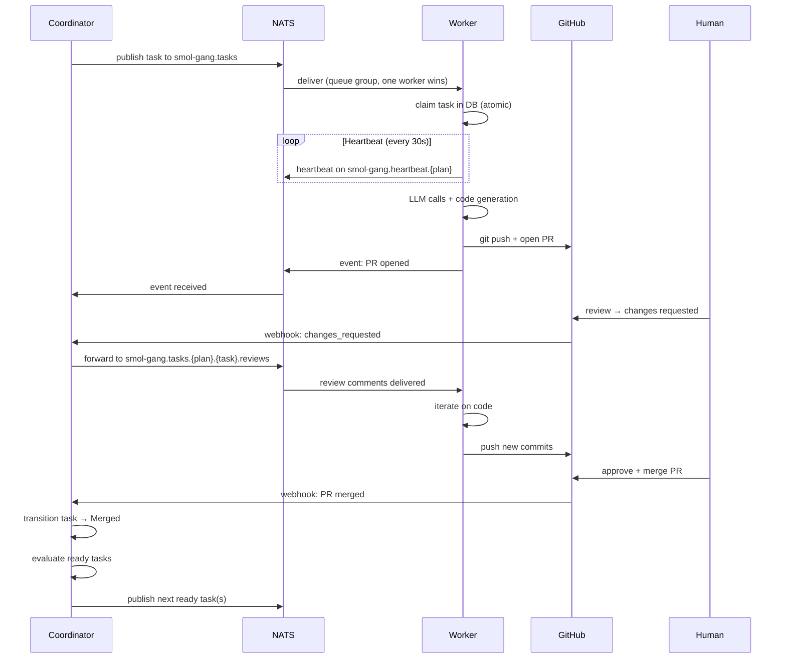

**Task Dispatch (Coordinator → Workers):**

```go
type TaskAssignment struct {
    PlanID      string         `json:"plan_id"`
    TaskID      TaskId         `json:"task_id"`
    Task        *TaskNode      `json:"task"`
    ParentSummaries []ParentSummary `json:"parent_summaries"`
    BranchName  string         `json:"branch_name"`
    PRTarget    string         `json:"pr_target"`
    RepoOwner   string         `json:"repo_owner"`
    RepoName    string         `json:"repo_name"`
}

func (c *Coordinator) publishReadyTask(ctx context.Context, taskID TaskId) error {
    // Transition to ready in DB
    if err := c.transitionTask(ctx, taskID, "ready"); err != nil {
        return err
    }

    assignment := c.buildTaskAssignment(taskID)
    data, _ := json.Marshal(assignment)

    // Publish to NATS queue group — one worker will receive it
    return c.nats.Publish("smol-gang.tasks", data)
}
```

**Worker subscribes to tasks:**

```go
func (w *Worker) Start(ctx context.Context) error {
    // Subscribe to task queue (queue group = competing consumers)
    sub, err := w.nats.QueueSubscribe("smol-gang.tasks", "workers", func(msg *nats.Msg) {
        var assignment TaskAssignment
        if err := json.Unmarshal(msg.Data, &assignment); err != nil {
            w.log.Error().Err(err).Msg("failed to parse task assignment")
            return
        }
        go w.executeTask(ctx, assignment)
    })
    if err != nil {
        return err
    }
    defer sub.Unsubscribe()

    <-ctx.Done()
    return nil
}
```

**Review Comment Forwarding (Coordinator → specific Worker):**

```go
// Coordinator forwards review comments to the specific task's subject
func (c *Coordinator) onChangesRequested(ctx context.Context, taskID TaskId, review interface{}) error {
    if err := c.transitionTask(ctx, taskID, "changes_requested"); err != nil {
        return err
    }

    data, _ := json.Marshal(review)
    subject := fmt.Sprintf("smol-gang.tasks.%s.%s.reviews", c.planID, taskID)
    return c.nats.Publish(subject, data)
}

// Worker subscribes to reviews for its specific task
func (w *Worker) subscribeToReviews(ctx context.Context, planID, taskID string) {
    subject := fmt.Sprintf("smol-gang.tasks.%s.%s.reviews", planID, taskID)
    w.nats.Subscribe(subject, func(msg *nats.Msg) {
        // Parse review, add to conversation, iterate
    })
}
```

### GitHub Integration

#### Branch Naming Convention

```
{root-branch}/{task-id}

Example:
  smol-gang/auth-system                     ← root feature branch
  smol-gang/auth-system/db-schema           ← task branch
  smol-gang/auth-system/user-model          ← task branch
```

#### PR Structure

**Root PR:**
- Title: `[smol-gang] {original task description}`
- Body: contains the full execution plan (task DAG as a markdown table or mermaid diagram)
- Target: `main` (or configured base branch)
- Created empty (no commits initially — child PRs merge into this branch)

**Task PRs:**
- Title: `[smol-gang/{task-id}] {task description}`
- Body: contains acceptance criteria, dependency list, agent work log
- Target: the root feature branch (NOT main)
- Labels: `smol-gang`, `wave-N`, `auto-generated`

**Git Branching and PR Merge Flow:**

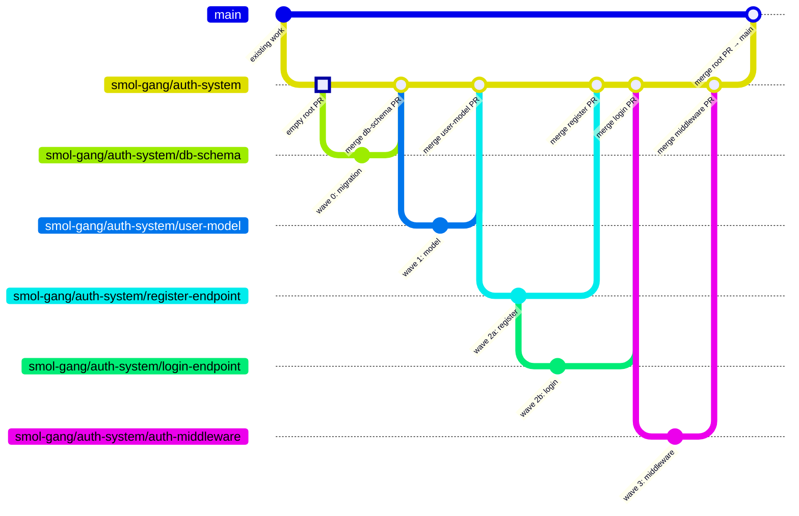

**PR Target Relationships:**

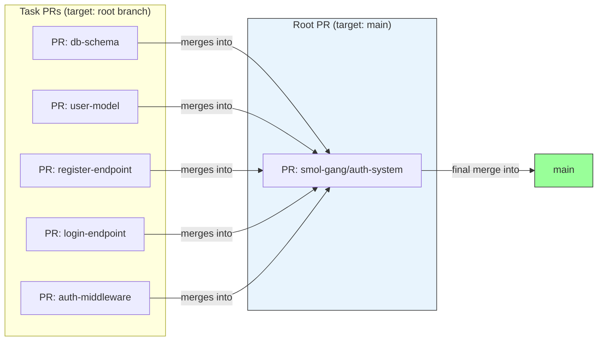

#### Event Handling

The Coordinator listens for GitHub events via one of:
- **Webhooks (preferred):** A net/http or Chi router endpoint receives GitHub webhook payloads. Events are persisted to the event log before processing.
- **Polling (fallback):** Periodically check PR status via GitHub API. Simpler to set up, higher latency. Also used during recovery to catch missed webhooks.

**Webhook handler:**

```go
func (c *Coordinator) webhookHandler(events chan Event) http.HandlerFunc {
    return func(w http.ResponseWriter, r *http.Request) {
        payload, err := github.ValidatePayload(r, []byte(c.config.WebhookSecret))
        if err != nil {
            http.Error(w, "invalid signature", http.StatusUnauthorized)
            return
        }

        event, err := github.ParseWebHook(github.WebHookType(r), payload)
        if err != nil {
            http.Error(w, "parse error", http.StatusBadRequest)
            return
        }

        switch e := event.(type) {
        case *github.PullRequestEvent:
            taskID := c.taskIDFromBranch(e.PullRequest.Head.GetRef())
            if taskID == "" {
                w.WriteHeader(http.StatusOK)
                return
            }

            if e.GetAction() == "closed" && e.PullRequest.GetMerged() {
                events <- Event{Type: EventPRMerged, TaskID: taskID}
            } else if e.GetAction() == "closed" && !e.PullRequest.GetMerged() {
                events <- Event{Type: EventPRRejected, TaskID: taskID}
            }

        case *github.PullRequestReviewEvent:
            taskID := c.taskIDFromBranch(e.PullRequest.Head.GetRef())
            if taskID == "" {
                w.WriteHeader(http.StatusOK)
                return
            }
            if e.Review.GetState() == "changes_requested" {
                events <- Event{
                    Type:    EventChangesRequested,
                    TaskID:  taskID,
                    Payload: e.Review,
                }
            }
        }

        w.WriteHeader(http.StatusOK)
    }
}
```

#### GitHub API Client

Use the `google/go-github` package. Required operations:
- Create branch (create git ref)
- Create PR
- Push commits (via git CLI subprocess or go-git library)
- Read PR reviews and comments
- Read PR merge status
- Add labels to PRs

### Notification Queue

An abstract notification sink for events requiring human attention. The Coordinator sends structured notification messages; the delivery mechanism is pluggable.

```go
type NotificationType string

const (
    NotifyMergeConflict NotificationType = "merge_conflict"
    NotifyPlanHalted    NotificationType = "plan_halted"
    NotifyPlanComplete  NotificationType = "plan_complete"
    NotifyAgentError    NotificationType = "agent_error"
)

type Notification struct {
    Type    NotificationType `json:"type"`
    TaskID  TaskId           `json:"task_id,omitempty"`
    Message string           `json:"message"`
    Details interface{}      `json:"details"`
}

type MergeConflictDetails struct {
    Branch           string   `json:"branch"`
    ConflictingFiles []string `json:"conflicting_files"`
    LikelyCause      []TaskId `json:"likely_cause"`
}

type PlanHaltedDetails struct {
    FailedTask   TaskId   `json:"failed_task"`
    Reason       string   `json:"reason"`
    BlockedTasks []TaskId `json:"blocked_tasks"`
    RootPR       int      `json:"root_pr"`
}

type PlanCompleteDetails struct {
    RootPR         int    `json:"root_pr"`
    TasksCompleted int    `json:"tasks_completed"`
    Summary        string `json:"summary"`
}

type NotificationSink interface {
    Send(ctx context.Context, n Notification) error
}
```

Initial implementation: log to stdout + write to a JSON file. Future implementations: Slack, Discord, email, webhook to external service.

### Ollama Integration

All LLM calls go through a shared Ollama client that handles:
- Model selection based on `ModelTier`
- JSON mode for structured output (decomposition)
- Streaming responses for long-form generation
- Retry with backoff on Ollama connection errors
- Concurrent request limiting via a semaphore

```go
type OllamaConfig struct {
    BaseURL       string        `toml:"base_url"`
    HeavyModel    string        `toml:"heavy_model"`
    LightModel    string        `toml:"light_model"`
    MaxConcurrent int           `toml:"max_concurrent"`
    Timeout       time.Duration `toml:"timeout"`
}

type OllamaClient struct {
    config     OllamaConfig
    httpClient *http.Client
    sem        chan struct{}
}

func (o *OllamaClient) Chat(ctx context.Context, req ChatRequest) (*ChatResponse, error) {
    o.sem <- struct{}{}
    defer func() { <-o.sem }()
    // POST to /api/chat
    // ...
}

func (o *OllamaClient) ModelForTier(tier ModelTier) string {
    switch tier {
    case ModelTierHeavy:
        return o.config.HeavyModel
    case ModelTierLight:
        return o.config.LightModel
    default:
        return o.config.HeavyModel
    }
}
```

**Distributed Ollama:** In a multi-machine setup, each worker can connect to its own local Ollama instance, or workers can be configured with different Ollama base URLs. The semaphore is per-client (per-worker), not global.

### Persistence Layer

PostgreSQL is the primary data store. SQLite is supported as a lightweight alternative for single-machine deployments.

**Schema:**

```sql
CREATE TABLE plans (
    id          TEXT PRIMARY KEY,
    prompt      TEXT NOT NULL,
    plan_json   TEXT NOT NULL,
    root_branch TEXT NOT NULL,
    root_pr     INTEGER,
    status      TEXT NOT NULL DEFAULT 'pending_approval',  -- pending_approval, active, halted, complete, rejected
    repo_owner  TEXT NOT NULL,
    repo_name   TEXT NOT NULL,
    base_branch TEXT NOT NULL,
    created_at  TIMESTAMPTZ NOT NULL DEFAULT NOW(),
    updated_at  TIMESTAMPTZ NOT NULL DEFAULT NOW()
);

CREATE TABLE tasks (
    id           TEXT NOT NULL,
    plan_id      TEXT NOT NULL REFERENCES plans(id),
    status       TEXT NOT NULL DEFAULT 'pending',
    branch_name  TEXT NOT NULL,
    pr_number    INTEGER,
    worker_id    TEXT,
    lease_expiry TIMESTAMPTZ,
    error        TEXT,
    result_summary TEXT,              -- LLM-generated summary after merge
    created_at   TIMESTAMPTZ NOT NULL DEFAULT NOW(),
    updated_at   TIMESTAMPTZ NOT NULL DEFAULT NOW(),
    PRIMARY KEY (id, plan_id)
);

CREATE INDEX idx_tasks_status ON tasks(plan_id, status);
CREATE INDEX idx_tasks_lease ON tasks(plan_id, lease_expiry) WHERE worker_id IS NOT NULL;

CREATE TABLE task_conversations (
    id         TEXT PRIMARY KEY,
    task_id    TEXT NOT NULL,
    plan_id    TEXT NOT NULL,
    role       TEXT NOT NULL,          -- system, user, assistant
    content    TEXT NOT NULL,
    sequence   INTEGER NOT NULL,
    created_at TIMESTAMPTZ NOT NULL DEFAULT NOW(),
    FOREIGN KEY (task_id, plan_id) REFERENCES tasks(id, plan_id)
);

CREATE INDEX idx_conversations_task ON task_conversations(task_id, plan_id, sequence);

CREATE TABLE events (
    id         TEXT PRIMARY KEY,
    plan_id    TEXT NOT NULL REFERENCES plans(id),
    task_id    TEXT,
    event_type TEXT NOT NULL,
    payload    TEXT,                    -- JSON
    processed  BOOLEAN NOT NULL DEFAULT FALSE,
    created_at TIMESTAMPTZ NOT NULL DEFAULT NOW()
);

CREATE INDEX idx_events_unprocessed ON events(plan_id, processed) WHERE NOT processed;
```

**Store interface (abstracts Postgres vs SQLite):**

```go
type Store interface {
    // Plans
    InsertPlan(ctx context.Context, plan *PlanRecord) error
    GetPlan(ctx context.Context, planID string) (*PlanRecord, error)
    UpdatePlanStatus(ctx context.Context, planID, status string) error

    // Tasks
    InsertTasks(ctx context.Context, tasks []*TaskRecord) error
    GetTasks(ctx context.Context, planID string) ([]*TaskRecord, error)
    UpdateTaskStatus(ctx context.Context, taskID, planID, status string, task *TaskState) error
    ClaimTask(ctx context.Context, taskID, planID, workerID string, leaseExpiry time.Time) (bool, error)
    ExtendLease(ctx context.Context, taskID, planID, workerID string, newExpiry time.Time) error
    ReclaimTask(ctx context.Context, taskID, planID string) error
    FindExpiredLeases(ctx context.Context, planID string) ([]*TaskRecord, error)

    // Conversations
    InsertConversationTurn(ctx context.Context, taskID, planID, role, content string, seq int) error
    GetConversation(ctx context.Context, taskID, planID string) ([]*ConversationRecord, error)

    // Events
    InsertEvent(ctx context.Context, evt Event) error
    EventProcessed(ctx context.Context, eventID string) bool
    MarkEventProcessed(ctx context.Context, eventID string) error
    GetUnprocessedEvents(ctx context.Context, planID string) ([]*EventRecord, error)
}
```

## Go Module Dependencies

```go
// go.mod
module github.com/yourorg/smol-gang

go 1.23

require (
    github.com/google/go-github/v68   // GitHub API client
    github.com/go-git/go-git/v5       // Git operations (optional, can use CLI)
    github.com/go-chi/chi/v5          // HTTP router for webhooks
    github.com/nats-io/nats.go        // NATS client for worker communication
    github.com/jackc/pgx/v5           // PostgreSQL driver
    github.com/mattn/go-sqlite3       // SQLite driver (single-machine mode)
    github.com/BurntSushi/toml        // Config file parsing
    github.com/rs/zerolog             // Structured logging
    github.com/spf13/cobra            // CLI framework
)
```

## Package Structure

```
smol-gang/
├── go.mod
├── go.sum
├── cmd/
│   ├── smol-gang/
│   │   └── main.go               # Coordinator CLI entry point
│   └── smol-gang-worker/
│       └── main.go               # Worker CLI entry point (separate binary)
├── internal/
│   ├── config/
│   │   └── config.go             # TOML config loading, validation
│   ├── assessor/
│   │   ├── assessor.go           # Complexity assessment LLM call + classification
│   │   └── prompt.go             # Assessment prompt template
│   ├── decomposer/
│   │   ├── decomposer.go         # Orchestrates decomposition LLM call + validation
│   │   ├── prompt.go             # Prompt templates and assembly
│   │   └── validate.go           # DAG validation (cycles, refs, heuristics)
│   ├── scheduler/
│   │   ├── dag.go                # DAG construction, adjacency list, in-degree tracking
│   │   ├── waves.go              # Wave computation via Kahn's algorithm
│   │   └── critical_path.go      # Critical path calculation
│   ├── coordinator/
│   │   ├── coordinator.go        # Main event loop, state management
│   │   ├── state.go              # CoordinatorState, TaskState types
│   │   ├── events.go             # Event types, event processing handlers
│   │   └── recovery.go           # Startup recovery and GitHub reconciliation
│   ├── worker/
│   │   ├── worker.go             # Worker process lifecycle
│   │   ├── claim.go              # Task claiming, lease management, heartbeat
│   │   ├── context.go            # WorkerContext assembly from DB
│   │   ├── conversation.go       # Conversation persistence and resumption
│   │   └── tools.go              # File, shell, git tool implementations
│   ├── github/
│   │   ├── client.go             # go-github wrapper
│   │   ├── webhook.go            # HTTP webhook handler
│   │   └── types.go              # PR, Branch, Review helper types
│   ├── ollama/
│   │   ├── client.go             # Ollama HTTP client with semaphore
│   │   └── models.go             # Model tier routing
│   ├── store/
│   │   ├── store.go              # Store interface definition
│   │   ├── postgres.go           # PostgreSQL implementation
│   │   └── sqlite.go             # SQLite implementation
│   ├── natsbus/
│   │   ├── bus.go                # NATS connection management
│   │   ├── publisher.go          # Task publishing, review forwarding
│   │   └── subscriber.go         # Task subscription, queue groups
│   └── notification/
│       ├── sink.go               # NotificationSink interface
│       ├── stdout.go             # Stdout sink implementation
│       └── jsonfile.go           # JSON file sink implementation
├── migrations/
│   ├── 001_create_plans.sql
│   ├── 002_create_tasks.sql
│   ├── 003_create_conversations.sql
│   └── 004_create_events.sql
├── smol-gang.toml                # Default config
└── README.md
```

## Concurrency and Distribution Model

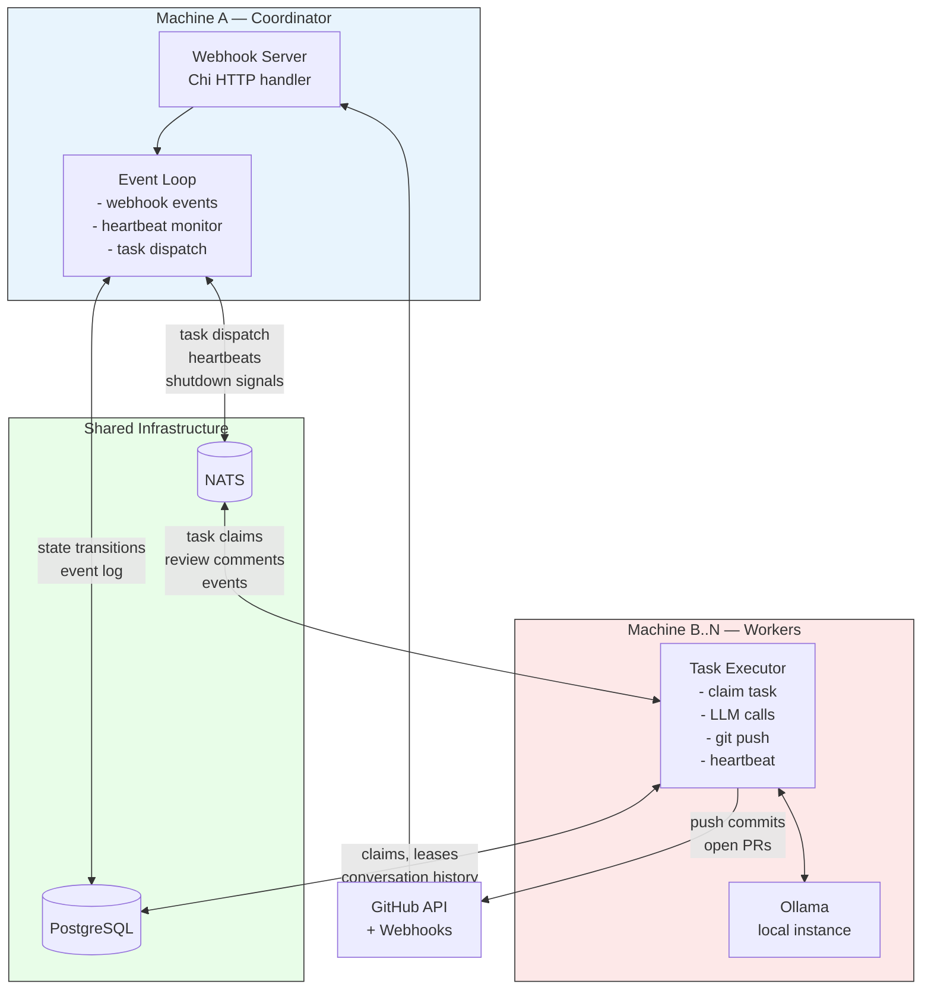

**Coordinator** is a single process (not horizontally scaled — it's the single leader). If it crashes, restart it; recovery reconciles everything.

**Workers** scale horizontally. Run as many as you have Ollama instances (or API quota). Each worker:
- Connects to NATS and PostgreSQL
- Subscribes to the task queue group (competing consumers)
- Has its own Ollama client (local or remote)
- Is fully stateless — all state is in the database

**NATS** handles pub/sub for task dispatch, reviews, heartbeats, and shutdown signals. Lightweight, single binary, easy to self-host.

**PostgreSQL** (or SQLite for single-machine mode) stores all durable state: plans, tasks, conversations, events.

## Failure Scenarios and Recovery

| Scenario | What Happens | Recovery |
|----------|-------------|----------|
| **Worker crashes mid-task** | Lease expires after `LeaseDuration` (e.g., 10 min). No heartbeat received. | Coordinator reclaims task, re-publishes to NATS. New worker claims it, loads conversation history from DB, resumes. |
| **Worker crashes after PR opened** | PR exists on GitHub, task still marked `pr_open` or `in_review` in DB. | New worker picks up, sees PR already exists, subscribes to reviews. |
| **Coordinator crashes** | Workers continue running (they have active leases). Webhooks queue up (GitHub retries). | On restart, Coordinator runs recovery: reconciles DB with GitHub, replays unprocessed events, reclaims stale tasks. |
| **Coordinator crashes during plan creation** | Plan may be partially written to DB. | Check plan status on startup. If `active` but root PR doesn't exist, re-create. If tasks not inserted, re-insert from `plan_json`. |
| **NATS goes down** | Workers can't receive new tasks. Heartbeats fail. | Workers retry NATS connection with backoff. Tasks aren't lost — they're in the DB. When NATS recovers, Coordinator re-publishes ready tasks. |
| **Database goes down** | Everything stops. Workers can't claim or heartbeat. Coordinator can't transition. | Workers and Coordinator retry with backoff. No data loss — DB is the source of truth. Resumes when DB recovers. |
| **GitHub webhook missed** | Event never reaches Coordinator. | Recovery polling: Coordinator periodically checks GitHub PR statuses for active tasks and reconciles. Runs on startup and optionally on a timer. |
| **Duplicate webhook received** | Same event arrives twice. | Idempotency: event ID is checked against `events` table. Already-processed events are skipped. |

**Failure Cascade (PR rejected):**

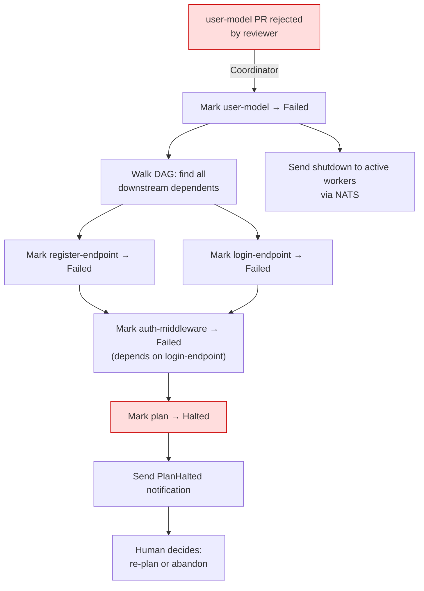

**Worker Crash Recovery:**

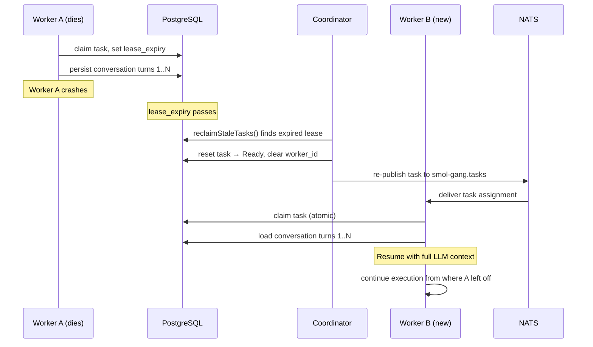

## Appendix A: Decomposition Prompt

### System Prompt

```
You are a task decomposition engine for a software development agent system.

Given a complex task description and optional repository context, you must break
the task into independent, parallelizable subtasks suitable for implementation
as separate Git branches and Pull Requests.

RULES:
1. Each task MUST be independently implementable as a single PR.
2. Each task MUST have a clear, specific scope — not vague or open-ended.
3. Tasks MUST declare dependencies explicitly. A task depends on another ONLY
   if it needs the code/artifacts from that task to exist first.
4. Minimize dependencies. Prefer independent tasks that can run in parallel.
5. Each task should touch a distinct set of files when possible. If two tasks
   must modify the same file, one MUST depend on the other.
6. Task descriptions must be specific enough for a coding agent to implement
   without ambiguity. Include file paths, function names, and expected behavior.
7. Include acceptance criteria for each task — concrete conditions that indicate
   the task is done.
8. The task graph MUST be a valid Directed Acyclic Graph (no circular dependencies).
9. Aim for 3-12 tasks. Fewer than 3 suggests the task doesn't need decomposition.
   More than 12 suggests over-decomposition — combine related work.
10. Each task ID must be a short kebab-case identifier (e.g., "db-schema", "auth-middleware").

Respond with ONLY valid JSON matching the schema below. No markdown, no explanation.
```

### JSON Schema

```json
{
  "type": "object",
  "required": ["plan_summary", "tasks"],
  "properties": {
    "plan_summary": {
      "type": "string",
      "description": "A 1-2 sentence summary of the overall plan and approach"
    },
    "tasks": {
      "type": "array",
      "items": {
        "type": "object",
        "required": ["id", "description", "depends_on", "file_scope", "acceptance_criteria"],
        "properties": {
          "id": {
            "type": "string",
            "pattern": "^[a-z][a-z0-9-]*$",
            "description": "Short kebab-case identifier"
          },
          "description": {
            "type": "string",
            "description": "Detailed implementation instructions for a coding agent"
          },
          "depends_on": {
            "type": "array",
            "items": { "type": "string" },
            "description": "Task IDs this task depends on. Empty array if independent."
          },
          "file_scope": {
            "type": "array",
            "items": { "type": "string" },
            "description": "Files or directories this task is expected to create or modify"
          },
          "acceptance_criteria": {
            "type": "array",
            "items": { "type": "string" },
            "description": "Concrete, verifiable conditions that indicate task completion"
          },
          "model_tier": {
            "type": "string",
            "enum": ["heavy", "light", "auto"],
            "default": "auto",
            "description": "Suggested model tier for this task"
          }
        }
      }
    }
  }
}
```

### User Prompt Template

```
TASK:
{user_prompt}

REPOSITORY CONTEXT:
{repo_tree_or_description}

Decompose this task into independent, parallelizable subtasks. Each subtask
will be implemented as a separate Pull Request by an autonomous coding agent.

Return ONLY valid JSON matching the provided schema.
```

### Example Output

For the prompt: "Add user authentication with JWT tokens, email/password registration, login endpoint, and protected route middleware to this Express.js API"

```json
{
  "plan_summary": "Decompose auth system into schema, model, registration, login, and middleware tasks. Schema and model are foundational; registration and login can parallelize once the model exists; middleware depends on the JWT infrastructure from login.",
  "tasks": [
    {
      "id": "db-schema",
      "description": "Create a database migration that adds a `users` table with columns: id (UUID, primary key), email (varchar 255, unique, not null), password_hash (varchar 255, not null), created_at (timestamp, default now), updated_at (timestamp, default now). Use the existing migration framework in /db/migrations/.",
      "depends_on": [],
      "file_scope": ["db/migrations/"],
      "acceptance_criteria": [
        "Migration file exists and runs without errors",
        "Users table is created with all specified columns",
        "Email column has a unique constraint",
        "Migration can be rolled back cleanly"
      ],
      "model_tier": "light"
    },
    {
      "id": "user-model",
      "description": "Create a User model in /src/models/user.js that wraps the users table. Include methods: create(email, password) that hashes the password with bcrypt before storing, findByEmail(email), and verifyPassword(plaintext, hash) that compares with bcrypt. Export the model.",
      "depends_on": ["db-schema"],
      "file_scope": ["src/models/user.js"],
      "acceptance_criteria": [
        "User.create() hashes passwords with bcrypt (min 10 rounds)",
        "User.findByEmail() returns user object or null",
        "User.verifyPassword() correctly compares plaintext to hash",
        "Unit tests pass for all three methods"
      ],
      "model_tier": "auto"
    },
    {
      "id": "register-endpoint",
      "description": "Add a POST /api/auth/register endpoint in /src/routes/auth.js. Validate that email is a valid email format and password is at least 8 characters. Use User.create() to store the user. Return 201 with { user: { id, email } } on success. Return 409 if email already exists. Return 400 for validation errors.",
      "depends_on": ["user-model"],
      "file_scope": ["src/routes/auth.js", "src/routes/index.js"],
      "acceptance_criteria": [
        "POST /api/auth/register creates a new user and returns 201",
        "Duplicate email returns 409",
        "Invalid email format returns 400",
        "Password under 8 chars returns 400",
        "Password is not included in the response body"
      ],
      "model_tier": "auto"
    },
    {
      "id": "login-endpoint",
      "description": "Add a POST /api/auth/login endpoint in /src/routes/auth.js. Accept email and password. Use User.findByEmail() and User.verifyPassword() to authenticate. On success, generate a JWT token (using jsonwebtoken library) with payload { userId, email } and expiry of 24h. Return 200 with { token }. Return 401 for invalid credentials. Store JWT_SECRET in environment variable.",
      "depends_on": ["user-model"],
      "file_scope": ["src/routes/auth.js"],
      "acceptance_criteria": [
        "POST /api/auth/login returns a valid JWT on correct credentials",
        "Invalid email or password returns 401",
        "JWT contains userId and email in payload",
        "JWT expires after 24 hours",
        "JWT_SECRET is read from environment, not hardcoded"
      ],
      "model_tier": "auto"
    },
    {
      "id": "auth-middleware",
      "description": "Create an authentication middleware in /src/middleware/auth.js. Extract the Bearer token from the Authorization header. Verify the JWT using the JWT_SECRET environment variable. On success, attach the decoded user payload to req.user and call next(). On failure, return 401 with { error: 'Unauthorized' }. Add an example protected route GET /api/protected that returns req.user.",
      "depends_on": ["login-endpoint"],
      "file_scope": ["src/middleware/auth.js", "src/routes/index.js"],
      "acceptance_criteria": [
        "Middleware extracts and verifies Bearer token from Authorization header",
        "Valid token: req.user is populated with decoded payload, next() is called",
        "Missing or invalid token: returns 401",
        "GET /api/protected returns user info when authenticated",
        "GET /api/protected returns 401 when not authenticated"
      ],
      "model_tier": "light"
    }
  ]
}
```

The dependency structure as a DAG with wave assignments:

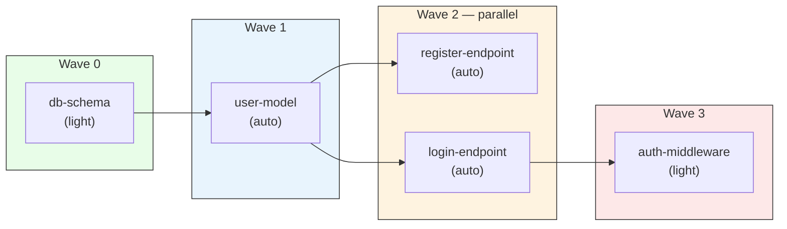

Maximum parallelism of 2 at Wave 2. Critical path: `db-schema → user-model → login-endpoint → auth-middleware` (4 sequential steps).

## Appendix B: Task Status State Machine

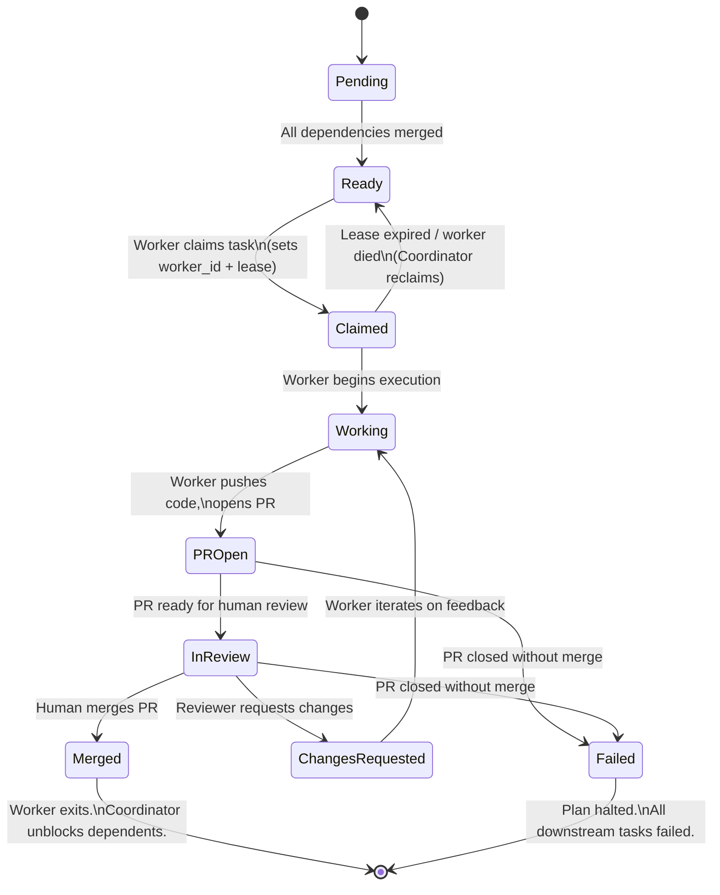

## Appendix C: Notification Message Examples

### Merge Conflict

```json
{
  "type": "merge_conflict",
  "task_id": "auth-middleware",
  "message": "Task 'auth-middleware' cannot rebase onto the root branch due to conflicts in src/routes/index.js. Likely caused by recent merges of 'register-endpoint' and 'login-endpoint'. Manual resolution required.",
  "details": {
    "branch": "smol-gang/auth-system/auth-middleware",
    "conflicting_files": ["src/routes/index.js"],
    "likely_cause": ["register-endpoint", "login-endpoint"]
  }
}
```

### Plan Halted

```json
{
  "type": "plan_halted",
  "task_id": "user-model",
  "message": "Plan halted: task 'user-model' (PR #42) was rejected. 3 downstream tasks are blocked. Re-planning required.",
  "details": {
    "failed_task": "user-model",
    "reason": "PR #42 closed without merge by reviewer",
    "blocked_tasks": ["register-endpoint", "login-endpoint", "auth-middleware"],
    "root_pr": 41
  }
}
```

## Appendix D: Configuration

```toml
# smol-gang.toml

[ollama]
base_url = "http://localhost:11434"
heavy_model = "llama3.1:70b"
light_model = "qwen2.5-coder:32b"
max_concurrent = 1
timeout = "5m"

[assessor]
confidence_threshold = 0.6       # below this, default to complex
# Override via CLI: --simple or --complex bypass assessment entirely

[github]
owner = "your-org"
repo = "your-repo"
base_branch = "main"
branch_prefix = "smol-gang"
webhook_port = 3000
webhook_secret = "your-webhook-secret"
# auth: uses GITHUB_TOKEN environment variable

[coordinator]
max_retries_per_task = 2
rebase_before_start = true
recovery_poll_interval = "5m"    # how often to poll GitHub as backup to webhooks

[worker]
lease_duration = "10m"           # how long a task claim is valid without heartbeat
heartbeat_interval = "30s"

[nats]
url = "nats://localhost:4222"
# For distributed: url = "nats://nats-server:4222"

[store]
driver = "postgres"              # "postgres" or "sqlite"
dsn = "postgres://localhost:5432/smolgang?sslmode=disable"
# For SQLite: dsn = "file:smolgang.db"

[notifications]
sink = "json_file"
file_path = "./notifications.json"
```

## Appendix E: CLI Interface

```
smol-gang - DAG-based multi-agent task orchestrator

COORDINATOR COMMANDS:
    smol-gang run        Assess complexity, decompose if complex, await approval, execute
    smol-gang status     Show status of an active plan
    smol-gang cancel     Cancel an active plan and clean up branches/PRs
    smol-gang recover    Manually trigger recovery/reconciliation for a plan

PLAN REVIEW & APPROVAL COMMANDS:
    smol-gang plan show          View a pending plan (tasks, DAG, waves)
    smol-gang plan list          List all plans and their statuses
    smol-gang plan edit          Modify a task in a pending plan
    smol-gang plan add-task      Add a new task to a pending plan
    smol-gang plan remove-task   Remove a task from a pending plan
    smol-gang plan add-dep       Add a dependency edge between tasks
    smol-gang plan remove-dep    Remove a dependency edge between tasks
    smol-gang plan approve       Approve a pending plan and begin execution
    smol-gang plan reject        Reject and discard a pending plan

COMPLEXITY FLAGS (override automatic assessment):
    --simple             Force simple mode (single PR, skip decomposition + approval)
    --complex            Force complex mode (always decompose into DAG)
    --auto-approve       Skip approval gate (for CI/CD or trusted automation)
    (default)            LLM assesses complexity automatically

WORKER COMMANDS:
    smol-gang-worker start    Start a worker process (connects to NATS, claims tasks)
    smol-gang-worker status   Show what task this worker is currently executing

EXAMPLES:
    # Auto-assess complexity — complex tasks pause for approval
    smol-gang run --prompt "Add user auth with JWT to this Express API"
    # → "Plan abc123 created (pending_approval). Use 'smol-gang plan show' to review."

    # Review the proposed plan
    smol-gang plan show --plan-id abc123

    # Tweak a task before approving
    smol-gang plan edit --plan-id abc123 --task db-schema \
        --description "Create migration with users table. Add email_verified boolean."
    smol-gang plan edit --plan-id abc123 --task db-schema \
        --add-criteria "email_verified column defaults to false"

    # Add a task the LLM missed
    smol-gang plan add-task --plan-id abc123 \
        --id email-verification \
        --description "Add email verification endpoint and service" \
        --depends-on register-endpoint \
        --file-scope "src/services/email.js,src/routes/verify.js"

    # Approve and start execution
    smol-gang plan approve --plan-id abc123

    # Or reject the plan entirely
    smol-gang plan reject --plan-id abc123

    # Force simple — small change, skip decomposition and approval
    smol-gang run --simple --prompt "Fix typo in README.md"

    # Force complex with auto-approve — for CI/CD
    smol-gang run --complex --auto-approve --prompt "Migrate from REST to GraphQL"

    # Load prompt from file
    smol-gang run --prompt-file task.md --config smol-gang.toml

    # Check plan status during execution
    smol-gang status --plan-id abc123
    smol-gang status --root-pr 41

    # Start workers (run on each machine with an Ollama instance)
    smol-gang-worker start --config smol-gang.toml
    smol-gang-worker start --config smol-gang.toml --ollama-url http://gpu-box-2:11434

    # Manual recovery
    smol-gang recover --plan-id abc123
```

## Appendix F: Deployment Topology Examples

### Single Machine (Development)

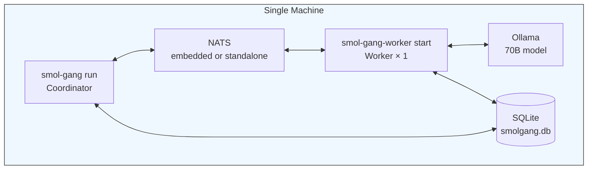

### Multi-GPU (Home Lab)

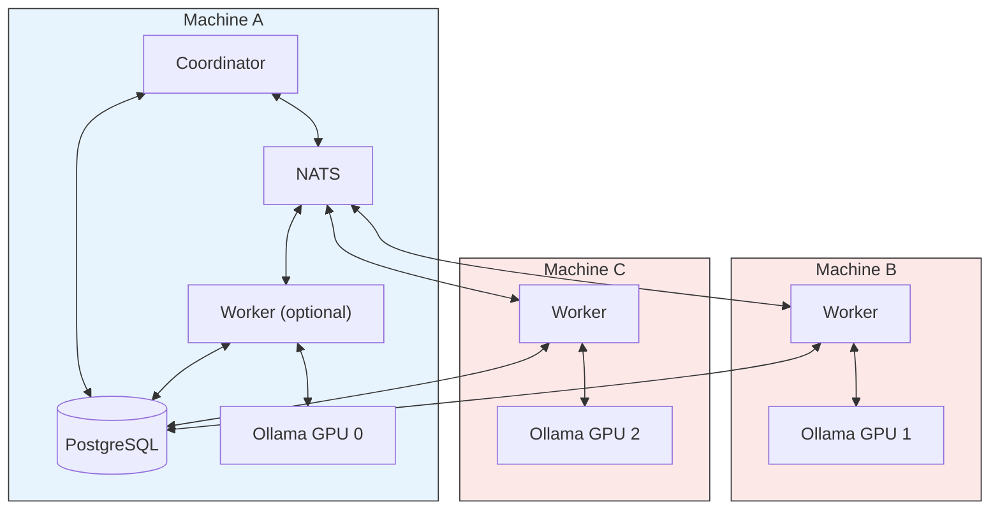

### Cloud / Kubernetes

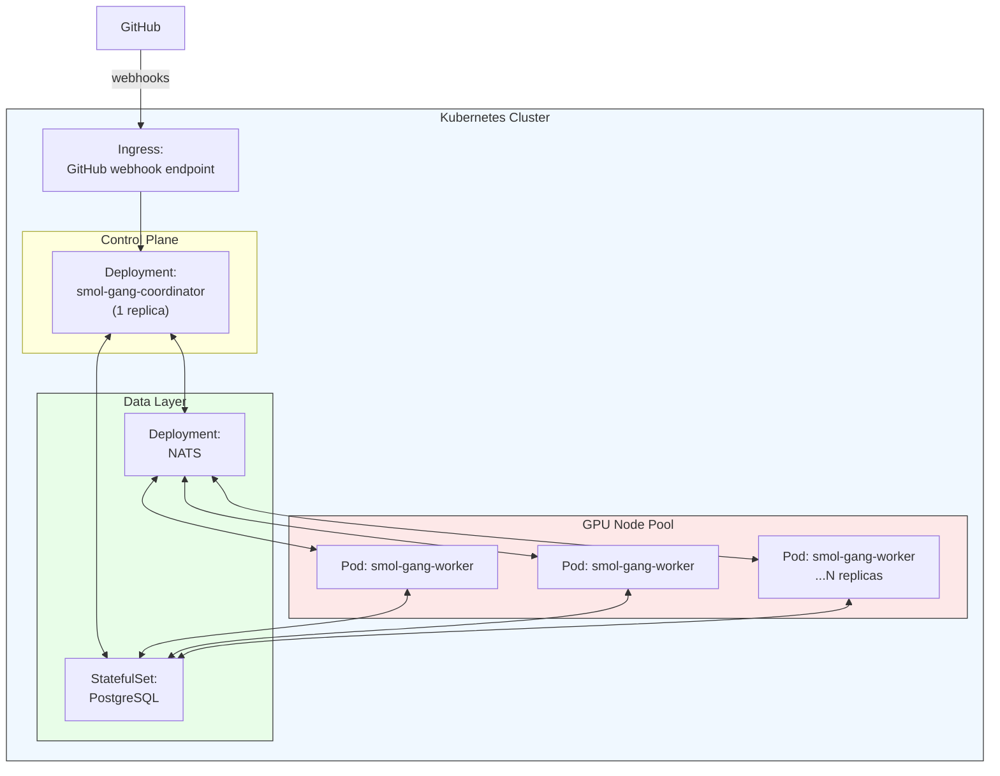

## Appendix G: Complexity Assessment Prompt

### System Prompt

```
You are a complexity assessor for a software development agent system.

Given a task description and optional repository context, classify whether this
task should be executed as a single Pull Request or decomposed into multiple
parallel subtasks.

CLASSIFICATION RULES:

A task is SIMPLE if ALL of these are true:
- It touches 1-3 files
- It involves a single logical concern (one cohesive change)
- There are no internal ordering dependencies (nothing needs to be built before
  something else within this task)
- A single developer could complete it in one sitting without context-switching
- The change is localized — it doesn't span multiple layers or modules

Examples of SIMPLE tasks:
- Fix a bug in a specific function
- Update a configuration value or environment variable
- Add a single API endpoint with its test
- Rename a module or refactor a single file
- Update a dependency version
- Add or fix a database migration
- Write or update documentation
- Add a single UI component with no new backend changes

A task is COMPLEX if ANY of these are true:
- It touches 4+ files across multiple modules, layers, or services
- It involves multiple distinct concerns that could be worked on independently
- It has internal ordering dependencies (X must exist before Y can be built)
- A human team would naturally split it into multiple PRs
- It requires changes at multiple architectural layers (database + model + API +
  frontend, for example)

Examples of COMPLEX tasks:
- Add a full authentication system (schema + model + endpoints + middleware)
- Implement a payment processing flow
- Migrate from one framework or library to another
- Build a new microservice or major feature
- Large-scale refactor across many files
- Add real-time functionality (WebSocket + backend + frontend)
- Implement a multi-step workflow (email verification, onboarding flow)

EDGE CASES — default to SIMPLE:
- If the task is ambiguous but could reasonably be done in one PR, classify as SIMPLE.
  The cost of unnecessary decomposition (coordination overhead, extra PRs, slower
  execution) is higher than the cost of a slightly large single PR.
- A task that touches 3-4 files but they're all closely related (e.g., a model file,
  its test file, and a migration) is SIMPLE.

Respond with ONLY valid JSON matching the schema below. No markdown, no explanation.
```

### JSON Schema

```json
{
  "type": "object",
  "required": ["complexity", "reasoning", "confidence", "est_tasks", "suggestion"],
  "properties": {
    "complexity": {
      "type": "string",
      "enum": ["simple", "complex"],
      "description": "Whether this task should be a single PR or decomposed"
    },
    "reasoning": {
      "type": "string",
      "description": "1-2 sentence explanation of why this classification was chosen"
    },
    "confidence": {
      "type": "number",
      "minimum": 0.0,
      "maximum": 1.0,
      "description": "How confident the classification is. Below 0.6 triggers default to complex."
    },
    "est_tasks": {
      "type": "integer",
      "minimum": 1,
      "description": "Estimated number of subtasks if decomposed. 1 for simple tasks."
    },
    "suggestion": {
      "type": "string",
      "description": "Brief description of the approach (for simple: what the single PR does; for complex: high-level decomposition strategy)"
    }
  }
}
```

### User Prompt Template

```
TASK:
{user_prompt}

REPOSITORY CONTEXT:
{repo_tree_or_description}

Assess whether this task should be executed as a single Pull Request (simple)
or decomposed into multiple parallel subtasks (complex).

Return ONLY valid JSON matching the provided schema.
```

### Example Outputs

**Simple task:** "Fix the off-by-one error in the pagination logic in src/api/users.js"

```json
{
  "complexity": "simple",
  "reasoning": "This is a single bug fix in one file. No decomposition needed.",
  "confidence": 0.95,
  "est_tasks": 1,
  "suggestion": "Fix the off-by-one error in the pagination calculation in src/api/users.js and update the corresponding test."
}
```

**Complex task:** "Add user authentication with JWT tokens, email/password registration, login endpoint, and protected route middleware to this Express.js API"

```json
{
  "complexity": "complex",
  "reasoning": "This spans multiple layers (database schema, model, multiple endpoints, middleware) with internal dependencies. The registration and login endpoints can be parallelized once the user model exists.",
  "confidence": 0.92,
  "est_tasks": 5,
  "suggestion": "Decompose into: database migration, user model, registration endpoint, login endpoint, and auth middleware. Schema and model are sequential; registration and login can parallelize; middleware depends on login."
}
```

**Edge case — leans simple:** "Add a health check endpoint that returns the app version and database connection status"

```json
{
  "complexity": "simple",
  "reasoning": "While this touches a route file and possibly a config file, it's a single cohesive concern with no internal dependencies. One PR is sufficient.",
  "confidence": 0.78,
  "est_tasks": 1,
  "suggestion": "Add a GET /health endpoint that returns JSON with app version from package.json and a database ping result."
}
```
